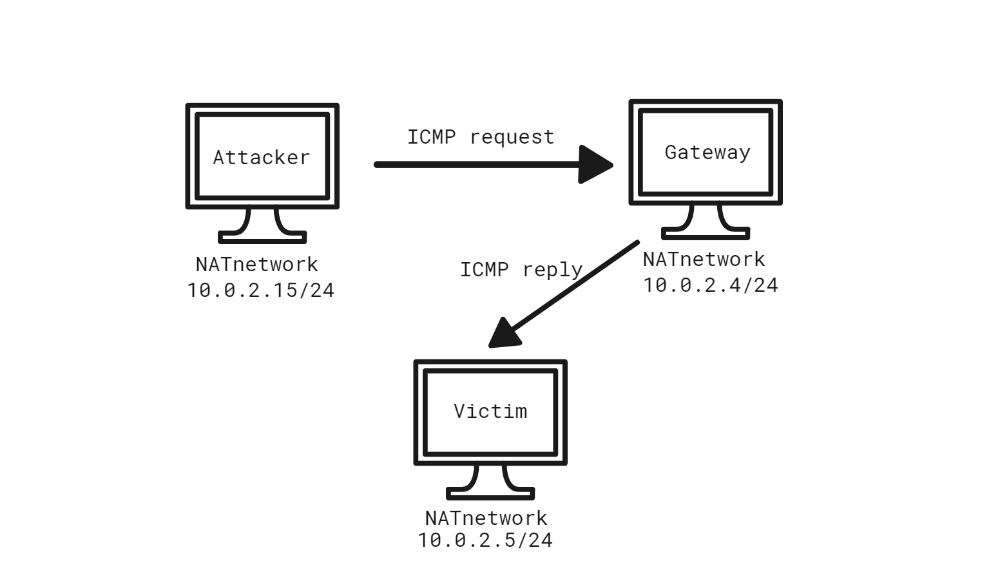

## chap0x08

### 实验一：使用 ufw 配置单机防火墙

- 安装 ufw

  ```
  apt install ufw
  ```

- 启用 ufw 

  ```
  sudo ufw enable;sudo ufw default deny
  ```

  

- 查看防火墙状态

  ```
  sudo ufw status
  ```

  

- 开启/禁用相应端口和服务举例

  ```
  # 允许外部访问80端口
  sudo ufw allow 80
  
  # 禁止外部访问80端口
  sudo ufw delete 80
  
  # 允许此IP访问所有的本机端口
  sudo ufw allow from 192.168.1.54
  
  # 禁止外部访问smtp服务
  sudo ufw deny smtp
  
  # 拒绝所有的流量从TCP的10.0.0.0/8到端口22的地址192.168.0.1
  sudo ufw deny proto tcp from 10.0.0.0/8 to 192.168.0.1 port 22
  
  # 可以允许指定段访问这个主机
  sudo ufw allow from 10.0.0.0/8
  ```

  

  至于上图指令的一些问题，简单地查看了一下`man` 手册，重新尝试一下。首先查看之前定义的规则：

  ```
  ufw status
  ```

  

  重新删除规则：

  ```
  ufw allow 80
  ufw delete 80
  ufw status 
  ```

  

  ```
  man ufw | grep delete
  ```

  

  **i.e.** 删除`允许外部访问80端口`这两条规则(v4，v6)，应该使用以下指令:

  ```
  ufw delete 6;ufw delete 1
  ```

  **注意：上面的删除指令应该先删除 num 更大的指令(上例中先删除6，后删除1)。因为如果先删除小的 num，规则会前移(一般应该不会重新排序)**

  

  所以上面的指令也可以这样写:

  ```
  ufw delete 1;ufw delete 5
  ```

  

  如果要禁止外部访问 80 端口，应该使用 `deny`。

- 规则测试

  实验环境: 两台 Nat Network 的 Kali 虚拟机，`ufw` 在IP 10.0.2.4 的虚拟机上；另一台 IP 为 10.0.2.15。为了方便测试，使用 Scapy 构造各种数据包。

  - 通过 ping 测试连通性:

  

  关闭 ipv6:

  ```
  emacs /etc/default/ufw
  
  - IPV6=yes
  + IPV6=no
  ```

  为了防止规则之间相互影响，清空之前定义的规则:

  ```
  # 重新设置 ufw
  ufw reset
  
  # 查看状态
  ufw status
  
  # 启动 ufw 
  ufw enable
  
  # 查看状态
  ufw status
  ```

  

  ufw 不允许在命令行接口中定义 icmp 规则，需要编辑`/etc/ufw/before.rules`:

  ```
  -A ufw-before-input -p icmp --icmp-type echo-request -j DROP
  ```

  测试结果:

  

  添加规则，默认所有进入的数据包 `deny`

  ```
  ufw default deny incoming
  ufw default allow outgoing		
  ```

  构造一个简单的 IP 包返送，Scapy 源码:

  ```python
  pkt = IP(dst = '10.0.2.4')/"helloworld"
  sr(pkt)
  ```

  

  目标主机成功接收，且没有返回数据包。

  添加规则，允许来自指定主机数据包:

  ```
  ufw allow from 10.0.2.15
  ```

  发送10个数据包：

  ```python
  for i in range(10):
  	sr(pkt,timeout = 5)
  ```

  

  共抓到 22 个数据包(arp req + arp reply + 10 * IP + 10 * icmp unreachable)


  开启本机 apache 服务:

  ```
  service apache2 start 
  ```

  删除上述规则`ufw allow from 10.0.2.15`，Scapy 简单 tcp connnect 扫描：

  ```python
  sr(IP(dst = "10.0.2.4")/TCP(dport = [80],flags = "S"),timeout = 5)
  ```

  

  添加允许 `10.0.2.15`访问本机 80 端口的 ufw 规则:

  ```python
  ufw allow from 10.0.2.15 to 10.0.2.4 port 80
  ```

  

 TCP Connection 扫描能够成功进行，之后 Ack + RST  这里就不再演示。

#### 实验二：iptables基本使用

关闭 ufw，清空 iptables 

```
# 关闭 ufw 
ufw disable

# 验证 ufw 关闭
ufw status

# 清空 iptables 
iptables --delete-chain
iptables --flush

# 查看 iptables 
iptables -L 
```

对比没有开启 docker 和 ufw 的虚拟机的iptables 及 之前开启了 docker 和 ufw 的虚拟机的 iptables:

```
# 安装了 ufw 和 docker 虚拟机的 iptables 
Chain INPUT (policy ACCEPT)
target     prot opt source               destination         

Chain FORWARD (policy ACCEPT)
target     prot opt source               destination         

Chain OUTPUT (policy ACCEPT)
target     prot opt source               destination         

Chain DOCKER (0 references)
target     prot opt source               destination         

Chain DOCKER-ISOLATION-STAGE-1 (0 references)
target     prot opt source               destination         

Chain DOCKER-ISOLATION-STAGE-2 (0 references)
target     prot opt source               destination         

Chain DOCKER-USER (0 references)
target     prot opt source               destination         

Chain ufw-after-forward (0 references)
target     prot opt source               destination         

Chain ufw-after-input (0 references)
target     prot opt source               destination         

Chain ufw-after-logging-forward (0 references)
target     prot opt source               destination         

Chain ufw-after-logging-input (0 references)
target     prot opt source               destination         

Chain ufw-after-logging-output (0 references)
target     prot opt source               destination         

Chain ufw-after-output (0 references)
target     prot opt source               destination         

Chain ufw-before-forward (0 references)
target     prot opt source               destination         

Chain ufw-before-input (0 references)
target     prot opt source               destination         

Chain ufw-before-logging-forward (0 references)
target     prot opt source               destination         

Chain ufw-before-logging-input (0 references)
target     prot opt source               destination         

Chain ufw-before-logging-output (0 references)
target     prot opt source               destination         

Chain ufw-before-output (0 references)
target     prot opt source               destination         

Chain ufw-reject-forward (0 references)
target     prot opt source               destination         

Chain ufw-reject-input (0 references)
target     prot opt source               destination         

Chain ufw-reject-output (0 references)
target     prot opt source               destination         

Chain ufw-track-forward (0 references)
target     prot opt source               destination         

Chain ufw-track-input (0 references)
target     prot opt source               destination         

Chain ufw-track-output (0 references)
target     prot opt source               destination   


# 未安装 docker 和 ufw 的虚拟机
Chain INPUT (policy ACCEPT)
target     prot opt source               destination         

Chain FORWARD (policy ACCEPT)
target     prot opt source               destination         

Chain OUTPUT (policy ACCEPT)
target     prot opt source               destination   
```

ufw 自定义规则链可以理解，但是 docker 为什么会定义规则链，这里 mark 一下，之后再解决。

#### 验证 iptables 配置实例:

(1) 传输层:

- 禁止其它机器通过`ssh`连接自己

```
iptables -t filter -A INPUT -p tcp --dport 22 -j DROP
```

Before:


After:


- `iptables -A FORWARD -p tcp --tcp-flags ALL SYN -m limit --limit 1/s -j ACCEPT` 定义在`forward `链上，这里不再测试

- 禁止 XMAS 扫描，并记录 XMAS 扫描到系统日志

  ```bash
  # 禁止 XMAS 扫描
  iptables -A INPUT -p tcp --tcp-flags ALL FIN,PSH,URG -j DROP
  
  # 上述规则之前记录 XMAS 扫描过程,insert序号默认为 1,log-level 默认为 4
  iptables -I INPUT -p tcp --tcp-flags ALL FIN,PSH,URG -j LOG --log-prefix "XMAS scan "
  ```

  这里使用 `nmap` 进行 `XMAS` 扫描:

  ```bash
  nmap -sX 10.0.2.4 -T4 -n
  ```

  返回结果:

  

  到内核记录、消息记录或是系统日志中查看扫描日志：

  ```bash
  # 根据scanner的ip查看消息记录，最好用标志位
  cat /var/log/messages | grep -a 10.0.2.15
  
  # 查看内核记录
  cat /var/log/kern.log | grep -a 10.0.2.15
  ```

  `kern.log`显示结果:

  

- 限制 ping 20 秒内不得超过 6 次。主要是 recent 模块的使用，这里只是简单了解一下，不再演示。


(2) 网络层: 

- 限制ping的并发数：

```
# 最大容量是5，每5秒产生一个令牌
iptables -A INPUT -p icmp --icmp-type echo-request -m limit --limit 12/m --limit-burst 5 -j ACCEPT

# 超出的数据包匹配下一条规则--直接丢弃（也可以设置多级限速）
# 默认 policy 为 accept，所以需要再定义 drop 规则
iptables -A INPUT -p icmp --icmp-type echo-request -j DROP
```

Before:


After:


在 `After` 中，可以看到 `scanner` 发送了 30 个数据包，只有 1、2、3、4、5、6、11、16、21、26得到了 `reply`。

原理解释：类比，桶里开始有 5 个包子，顾客每分钟吃 1 个，而厨师每5 分钟做 1 个，问 30 分钟之内顾客吃了多少包子？（时间由 min 改成 sec，同时编个号就是以上原理...）


（3）数据链路层: 阻断来自某个mac地址的数据包

`iptables -F`清除之前的规则。`ifconfig` 查看 `scanner` 的 `mac` 为 `08:00:27:5a:55:e6`，`defender` 添加链路层的 `iptables` 限制

```
iptables -A INPUT -m mac --mac-source 08:00:27:5a:55:e6 -j DROP
```

After:


#### 实验三：iptables 实现 NAT

实现需要3步（1）真实 IP 绑定到防火墙的外网接口 （2）网关配置 DNAT （3）网关配置 SNAT

用 iptables 做一个简单的实验。网络拓扑图:


只需设置 `Attacker` 的 SNAT，指令如下:

```bash
iptables -t nat -A POSTROUTING -s 10.0.2.15 -j SNAT --to 10.0.2.5
```

`Attacker`如果`ping`网关，`victim`将不明所以地接受到网关的 `icmp reply`数据包。结果如下:


如果只是从 `gateway` 的 `tcpdump` 打印输出中还真的看不出什么问题，但是如果简单地去比较一下 `request` 的 `source mac`和 `reply`的 `des mac`就能发现两者的 mac 并不相同。

既然如此，如果`attacker`先使用 `arp -a` 查看 `victim`的 mac ，之后修改自身的 mac 为 `victim`的 mac ，然后实施上述的攻击，应该就不会出问题了吧？

实验失败。当 `attacker` 修改自身的 mac 为 `victim` 的mac时，会产生一个 `arp` 广播报文，网关根据 `arp`中的mac( victim 的 mac)，将 `victim`的 `ip`地址返回给 `attacker`，这样`attacker`的 `ip`和 `victim`的`ip`变得相同，地址冲突，攻击无法实施。(之前的实验忘了截图...)


#### 实验四：防火墙规则调试

主要是 `raw` 链上的 `trace` 功能，`trace`日志的分析太复杂，这里就没有进行具体实验。


### 附录：iptables 实验清单

主要是几个已经写好的 bash 脚本，直接再 Kali 自带的 bash 中跑一下( 相当于在命令中输入特定的指令 )。还有就是 `proftpd` 的配置( 目的为了能够使用 ftp 服务)，这里也不再一一演示。


#### 课外实验

##### 场景描述( 课本中的内容可以跳过，直接看回答 )

局域网拓扑如下：

```
+----------------------+          +-------------------------+       +----------------------+     
|     host-1           |          |   host-2                |       |     host-3           |  
|     172.16.18.11     |          |   eth0:0 172.16.18.1    |       |     172.16.18.12     |  
|                      |          |   eth0: 192.168.1.123   |       |                      |  
+-------------+--------+          +----------+--------------+       +-------------+--------+  
              |                              |                                    |
              |                              |                                    |
     +--------+------------------------------+--+                                 |
     |                交换机                    |---------------------------------+
     +-----------------+------------------------+
                       |
                       |
                 +-----+-----------+
                 |   eth0          |   `
                 |   192.168.1.1   |
              +--+-----------------+---------+
              |                              |
              |        host-gw / dns-svr     |
              |                              |
              +------------------+----------++
                                 |  eth1    |
                                 +----------+
```

上图的补充文字说明如下：

- host-gw 指的是该局域网的网关，已经配置为 NAT 方式，局域网内的主机 host-2 可以正常无障碍访问互联网；
- dns-svr 指的是该局域网中的 DNS 解析服务器，可以正常提供域名解析服务；
- 交换机没有设置 VLAN，所有端口正常工作；
- host-2上配置了 iptables规则；
- host-1上配置了默认网关指向 IP 地址：172.16.18.1，域名解析服务器配置为 IP：192.168.1.1
- host-3上配置了默认网关指向 IP 地址：172.16.18.1，域名解析服务器配置为 IP：192.168.1.1

##### host-2 上的 iptables 配置脚本如下：

```
#!/bin/bash

IPT="/sbin/iptables"

$IPT --flush
$IPT --delete-chain

$IPT -P INPUT DROP
$IPT -P FORWARD DROP
$IPT -P OUTPUT ACCEPT

# 自定义规则链 forward_demo
$IPT -N forward_demo
# 自定义规则链 icmp_demo
$IPT -N icmp_demo


$IPT -A INPUT -i lo -j ACCEPT
$IPT -A OUTPUT -o lo -j ACCEPT

$IPT -A INPUT -p tcp ! --syn -m state --state NEW -s 0.0.0.0/0 -j DROP

$IPT -A INPUT -m state --state ESTABLISHED,RELATED -j ACCEPT

$IPT -A INPUT -p icmp -j icmp_demo

$IPT -A icmp_demo -p icmp -i eth0 -j ACCEPT
$IPT -A icmp_demo -j RETURN

$IPT -A FORWARD -j forward_demo

$IPT -A forward_demo -j LOG --log-prefix FORWARD_DEMO
$IPT -A forward_demo -p tcp --dport 80 -m string --algo bm --string 'baidu' -j DROP
$IPT -A forward_demo -p tcp -s 172.16.18.11 -j ACCEPT
$IPT -A forward_demo -p tcp -d 172.16.18.11 -j ACCEPT
$IPT -A forward_demo -p udp -s 172.16.18.11 --dport 53 -j ACCEPT
$IPT -A forward_demo -p udp -s 172.16.18.1  --dport 53 -j ACCEPT
$IPT -A forward_demo -p udp -s 192.168.1.1  --sport 53 -j ACCEPT
$IPT -A forward_demo -p tcp -s 172.16.18.1 -j ACCEPT
$IPT -A forward_demo -s 172.16.18.1 -j RETURN

$IPT -t nat -A POSTROUTING -s 172.16.18.1/24 -o eth0 -j MASQUERADE
```

##### 实验任务要求

- 请对以下脚本逐行添加代码注释
- host-1可以ping通ip: 172.16.18.1吗？
- host-1可以ping通ip: 192.168.1.1吗？
- host-1可以ping通域名: www.baidu.com吗？
- host-1可以访问： <http://www.baidu.com> 吗？
- host-1可以访问：<http://61.135.169.121> 吗？
- host-3可以ping通ip: 172.16.18.1吗？
- host-3可以ping通ip: 192.168.1.1吗？
- host-3可以访问互联网吗？


题目中的 host2 网卡名称不是很清楚，这里标明 `eth0:172.16.18.1,eth1:192.168.1.123 `回答问题：

- host-1可以ping通 ip: 172.16.18.1吗？
  - 可以。第一个ping包进入到 `icmp_demo`链，匹配`IPT -A icmp_demo -p icmp -i eth0 -j ACCEPT`规则，`state`变化 `New`=> `ESTABLISHED`，之后直接匹配规则`IPT -A INPUT -m state --state ESTABLISHED,RELATED -j ACCEPT`。全程都可以ping 通。
- host-1可以ping通ip: 192.168.1.1吗？
  - 不行。ping包进入`FORWARD `链，没有`icmp`协议的 iptables 规则，规则链默认策略为 `Drop`，直接丢弃。
- host-1可以ping通域名: www.baidu.com吗？
  - 不行。DNS 解析的过程虽然经过 `FORWARD`链，但是 iptables 中双向都是 Accept，但是ping的过程和第二题一样，直接丢弃。

- host-1可以访问： <http://www.baidu.com> 吗？
  - 不行。DNS 解析过程没问题，但是 tcp 连接匹配规则`$IPT -A forward_demo -p tcp --dport 80 -m string --algo bm --string 'baidu' -j DROP`，`payload`包含`baidu`数据包被丢弃。
- host-1可以访问：<http://61.135.169.121> 吗？

  - 可以。匹配规则`$IPT -A forward_demo -p tcp -s 172.16.18.11 -j ACCEPT`
    和`$IPT -A forward_demo -p tcp -d 172.16.18.11 -j ACCEPT`
- host-3可以ping通ip: 172.16.18.1吗？
  - 可以。同1
- host-3可以ping通ip: 192.168.1.1吗？
  - 不行。同2
- host-3可以访问互联网吗？
  - 不行。host-3 向 host-2 发送的 UDP包没用匹配任何 iptables 规则，根据默认策略直接被丢弃。


### 参阅

- [iptables](https://www.frozentux.net/iptables-tutorial/cn/iptables-tutorial-cn-1.1.19.html#RCFIREWALLTXT)

- [实验](http://sec.cuc.edu.cn/huangwei/textbook/ns/chap0x08/exp.html)
