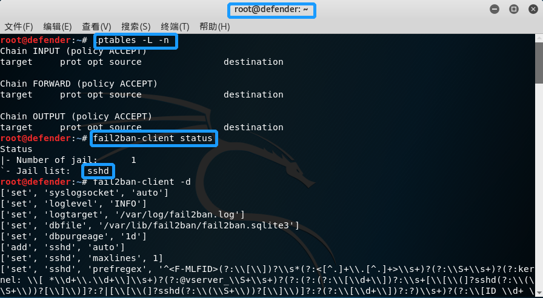
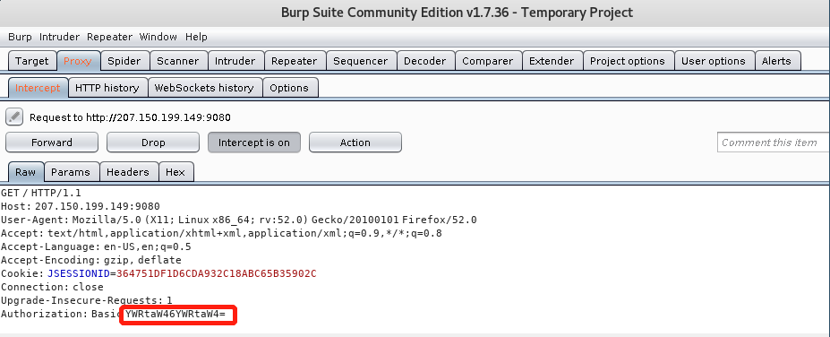
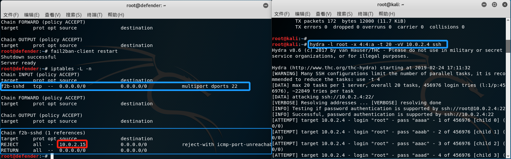
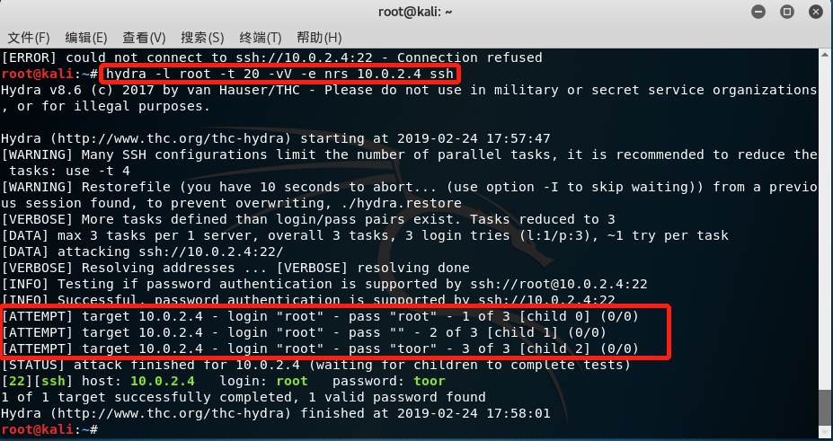
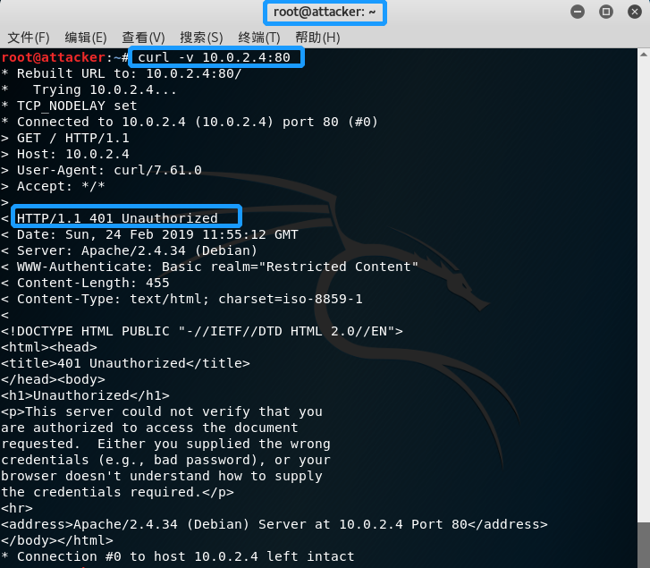
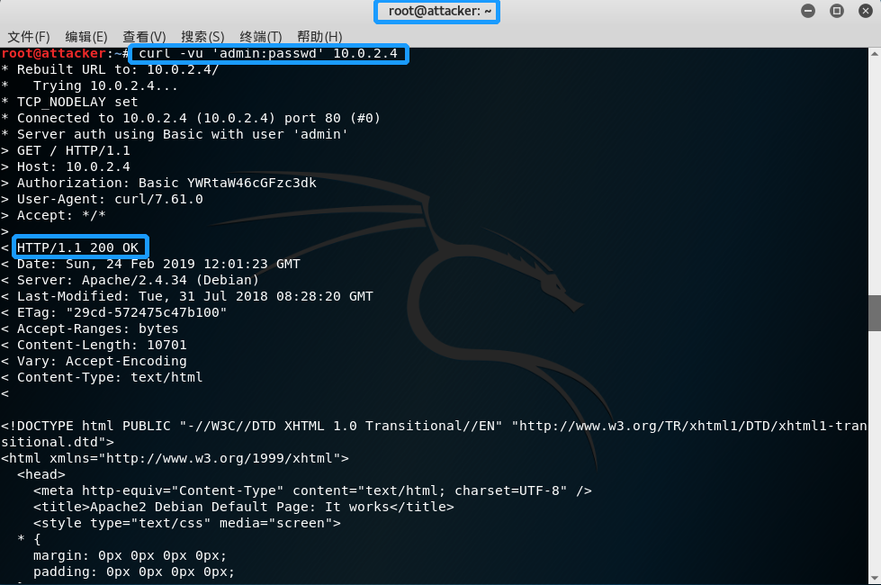
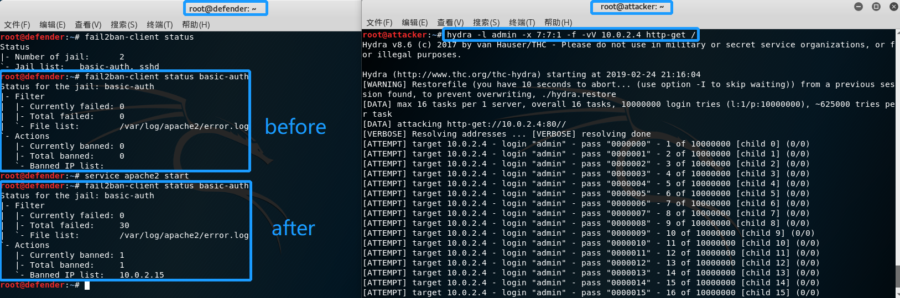

## chap0x10 实战fail2ban防止Basic认证暴力破解和SSH口令爆破

### I   实验环境

- OS: Kali  
- Net: NAT Network
-  IP: Attacker >>>10.0.2.15，Defender >>> 10.0.2.4

#### II   基础知识

- FAIL2BAN 原理：根据系统登录日志统计登录失败IP，并联动 iptables 限制登录。

  - Defender 安装 FAIL2BAN

  ```bash
  sudo apt-get install fail2ban
  
  # 查看帮助信息
  fail2ban-client -h
  ```

- Fail2Ban 配置 SSHD (参照[知乎](https://zhuanlan.zhihu.com/p/33546122)) : 在同一目录下创建一个 `jail.local`的新配置文件:

  ```bash
  cp /etc/fail2ban/jail.conf /etc/fail2ban/jail.local
  ```

  修改配置文件中的配置，`[sshd]`中的`enabled = true`，之后重启 `fail2ban`:

  ```bash
  service fail2ban restart
  
  # 查看 iptables 规则
  iptables -L -n
  
  # 查看 fail2ban 的状态信息
  fail2ban-client status
  ```

  


- BASIC 认证：当浏览网页时，返回的 status code 为 200 时，表示可以正常访问；当status code 为401  时， 表示(未授权)请求要求身份验证，一般都称401认证。BASIC 认证即401认证。

  在 [钟馗之眼](https://www.zoomeye.org/) 随便找了一个 status code 为 401 的主机，`firefox`访问，随意输入认证的用户名和，密码，`BurpSuite`拦截到的请求内容如下：
  

  `Authorization`字段是一段 `Base64` 编码，解码的内容就是`username:password`的格式。暴力破解就是不断更改字段值，直到找的正确的值为止。


- 配置 Basic 认证：设置登录使用的用户名和密码

  ```bash
  #  -c  Create a new file.
  #  -b  Use the password from the command line rather than prompting for it.
  htpasswd -bc /etc/apache2/sites-enabled/db admin passwd
  ```

  配置`/etc/apache2/sites-enabled/000-default.conf`，添加以下内容:

  ```
  <Directory "/var/www/html">     
  AuthName "test field"
  AuthType Basic                 
  AuthName "Restricted Content"  
  AuthUserFile /etc/apache2/sites-enabled/db   
  Require valid-user  
  </Directory>
  ```

  重启服务`service apache2 restart`

- Fail2ban配置 Basic：同上，在 `/etc/fail2ban/jail.local`中自定义jail `[basic-auth]`，增添的规则如下:

  ```
  [basic-auth]
  enabled = true
  filter  = apache-auth
  action  = iptables-multiport[name=basic-auth,port="80,443"]
            sendmail[name=basic-auth, dest=m13723133446@163.com]
  logpath = /var/log/apache2/error.log
  bantime = 86400
  maxretry = 5
  ```

  `fail2ban-client restart`，查看是否正常工作:

  ```bash
  fail2ban-client status
  fail2ban-client status basic-auth
  ```

  


#### III   实验

SSH 爆破和 Basic 认证爆破都是使用 `hydra`。

- SSH 爆破

  假设已知密码为四位小写字母组合( toor )。Attacker 输入以下指令:

  ```bash
  hydra -l root -x 4:4:a -t 20 -vV 10.0.2.4 ssh 
  ```

  结果查看 `defender`的 iptables:

  

  `/var/log/fail2ban.log `日志文件中有详细的记录。下面是`hydra`爆破成功的截图，`fail2ban-client unban all`清空 `ban ip`，返回值为 0 表示清除成功。`Attacker`中输入以下指令：

  ```bash
  #   -e nsr    
  # try "n" null password, "s" login as pass and/or "r" reversed login
  hydra -l root -t 20 -vV -e nrs 10.0.2.4 ssh 
  ```

  

  可以看到以上指令通过将 `login`值颠倒，得到正确的密码，成功爆破。

- Basic认证爆破

  查看 Basic 设置是否成功：

  ```bash
  curl -v 10.0.2.4
  ```

  

  检查设置的用户名和密码是否有效:

  ```bash
  curl -vu 'admin:passwd' 10.0.2.4
  ```

  

  使用 `hydra` 爆破：

  ```bash
  # 7位数字组合的密码字典
  hydra -l admin -x 7:7:1 -f -vV 10.0.2.4 http-get /
  ```

  结果如下:

  

  之后查了一下邮箱没有收到邮件...（未解决，猜测可能是`pop3,imap,smtp,pop3s,imaps,smtps`等服务没开...）


### 参阅

- [ssh服务的暴力破解防护--fail2ban](https://www.jianshu.com/p/70ee464464ff)

- [MANUAL 0 8](https://www.fail2ban.org/wiki/index.php/MANUAL_0_8#Definitions)
- [如何在 Linux 上用 Fail2Ban 保护服务器免受暴力攻击](https://zhuanlan.zhihu.com/p/33546122)

- [Apache用户认证配置之Basic认证](https://979137.com/archives/168.html)
- [实战fail2ban防止Basic认证暴力破解和SSH口令爆破](https://blog.csdn.net/jackcily/article/details/85149769)