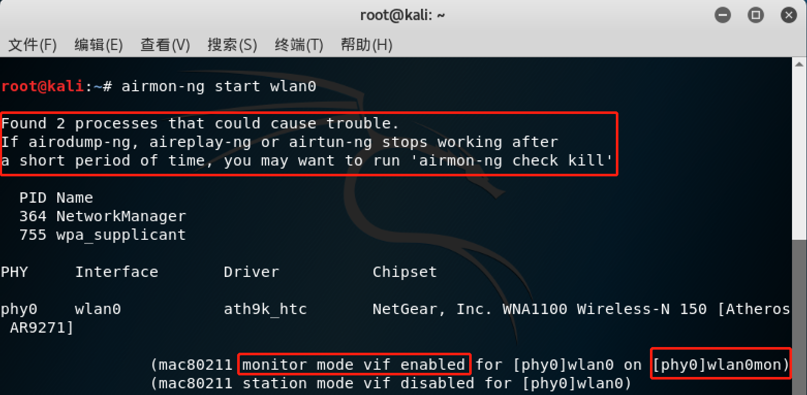
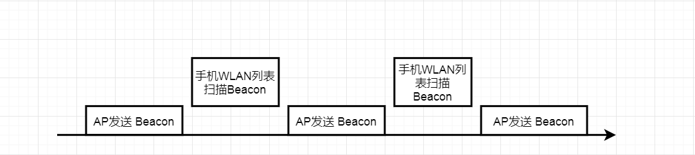

### 无线网卡配置与使用


**实验内容：通过分析抓包保存的pcap文件**

- 查看统计当前信号覆盖范围内一共有多少独立的SSID？其中是否包括隐藏SSID？哪些无线热点是加密/非加密的？加密方式是否可知？
- 如何分析出一个指定手机在抓包时间窗口内在手机端的无线网络列表可以看到哪些SSID？这台手机尝试连接了哪些SSID？最终加入了哪些SSID？
- SSID包含在哪些类型的802.11帧？


 **注：实验输入各种指令，部分结果图片以指令命名。**


#### BASIS

帧的分类及作用：

```
[=] Management Frame  (wlan.fc.type == 0x00)

   用于STA与AP之间协商、关系的控制。

[+] Beacon Frame (wlan.fc.type_subtype == 0x08)

   一个提供服务的AP会定时发送Beacon Frame以告知BSS的存在，并提供了BSS的一些基本信息，如BSSID、SSID、Channel等。

[+] Probe Request / Probe Response (wlan.fc.type_subtype == 0x04) / (wlan.fc.type_subtype == 0x05)

   Probe request由STA发出，用于探测周围的BSS。如果指定了SSID，则只有SSID与之一致的BSS(准确来说是BSS内的AP)会通过Probe Response进行响应；如果未指定，则所有BSS都会进行响应。和Beacon Frame一样，Probe Response提供了BSS的基本信息。

[+] Authentication (wlan.fc.type_subtype == 0x0B)

   Authentication中，包含认证类型(Authentication Algorithm)，认证进度(Authentication SEQ)，认证状态(Status Code)。AP可以根据相关信息决定接受还是拒绝某个STA的加入，并同样通过Authentication进行回复。

[+] Deauthentication (wlan.fc.type_subtype == 0x0C)

   用来终结认证关系。

[+] Association Request / Association Response (wlan.fc.type_subtype == 0x00) / (wlan.fc.type_subtype == 0x01)

   一旦STA找到网络并通过认证，就会发送Association Request，请求 AP 进行关联。AP以Association Response进行回应。如果AP接受该请求，将为该STA分配资源。
 
[+] Reassociation Request / Reassociation Response (wlan.fc.type_subtype == 0x02) / (wlan.fc.type_subtype == 0x03)

   当STA远离原AP，并发现相同的 ESS 里有另一个信号更强的AP时，STA将发送Reassociation Request。AP以Reassociation Response进行回应。一旦AP接受该请求，将为该STA分配资源，由此AP提供服务。

[+] Disassociation (wlan.fc.type_subtype == 0x0A)

   用来终结关联关系。收到Disassociation后，AP将释放先前为该STA分配的资源。
   
   
[=] Control Frame (wlan.fc.type == 0x02)

[+] Acknowledgement Frame (wlan.fc.type_subtype == 0x1d)
	
	接受到数据后回复确认
	
[+] Request to Send Frame / Clear to Send Frame (wlan.fc.type_subtype == 0x1b) / (wlan.fc.type_subtype == 0x1c)

	当RTS/CTS启用时，一个站在发送数据帧之前发送一个RTS帧，当接收方愿意接收额外的流量时，它会响应一个CTS帧。在RTS/CTS交换之后，这个站开启一个时间窗口（在CTS帧中标识），用于向确认接收的站发送数据帧。
	

[=] Data Frame (wlan.fc.type == 0x02)

[+] Data (wlan.fc.type_subtype == 0x20)

[+] Null (wlan.fc.type_subtype ==0x24)

[+] Qos Data (wlan.fc.type_subtype == 0x28)

[+] Qos Null (wlan.fc.type_subtype == 0x2c)

```

资料来源：https://www.binss.me/blog/notes-of-802.11-protocal/


**认证过程:**


**实验网络环境描述：通过插入网线接入校园网，IP: 10.196.14.175，实验手机 MAC：8c:eb:c6:34:c1:26**


**简单提一下 网卡检测不到问题（已解决）**

解决方案：

1) . 插入网卡，若虚拟机左上角 **“设备”**  => **"USB"** ，无网卡信息，手动换 usb 接口。

2) . 若检测到网卡的插入，在虚拟机内部输入:

```
ifconfig -a 
```

无网卡信息，打开 VirtualBox 管理器，打开 **“设备”**，设备筛选器中添加网卡：


插入网卡，输入指令查看设备

```
iwconfig
```


扫描附近无线网络，输出信息太多，按照 textbook，查看 SSID：

```
iw dev wlan0 scan | grep SSID｜xargs -0 echo -e
```


其中第一个热点是宿主机开的（使用软件: **WiFi 共享精灵**）


textbook 中提到 Monitor mode 和 Managed mode 的区别： 

> 3种不同的无线数据抓包方式（ wireshark、tshark、airodump-ng ）都可以抓取包含802.11完整帧结构的数据报文（Monitor模式下）或仅抓取802.11帧 payload 信息部分（Managed模式下）。 

为了更好地观察数据包，使用 Monitor mode。通过 airmon-ng 开启 Monitor:



简单地查看一下关键信息。接下来尝试 airodump-ng 抓包（首先使用 channel hopping）：

```
airodump-ng wlan0mon --beacons
```


ctrl + c 退出后，重新抓包并保存（还是使用 channel hopping）：

```
airodump-ng wlan0mon -w saved --beacons
```

抓包 1 min 退出。打开文件夹：


查看独立的 SSID，输入指令：

```
aircrack-ng saved-01.cap
```


BSSID 共有 22 个。 其中有 2 个没有 ESSID，加密类型 Unknown、None(0,0,0,0)。**猜测是隐藏 SSID。**

**隐藏 SSID 原理**

```**Beacon frame** is one of the management frames in [IEEE 802.11](https://en.wikipedia.org/wiki/IEEE_802.11) based WLANs.
It contains all the information about the network. Beacon frames are transmitted periodically, they serve to announce the 
presence of a wireless LAN and to synchronise the members of the service set. 
```

资料来源：https://en.wikipedia.org/wiki/Beacon_frame

**i.e.** AP 是通过广播 Beacon 管理帧，STA 收到这些帧即可感知到 BSS。同时，也说明了一点，Beacon 是携带ESSID 的。隐藏 SSID，最简单方法应该就是在一段时间内不再广播 Beacon Frame。现在还有一些问题：


**{1} . 既然 SSID 是隐藏的，为什么用 aircrack-ng 分析数据包能够发现？（未解决）**

只能说一下个人猜测，SSID 隐藏，一般都是为了自己使用而不让别人**使用**（准确来说是 **发现**），i.e. 隐藏的BSS 是专门设置为特定的人服务，当然具备 AP 转发数据包的功能。这样，我们可抓取数据包，分析数据包中SSID信息来证明 该SSID 的存在。

**补充解决方案**

- Probe Request / Probe Response
- Association Request / Association Response
- Authentication Frame
- Data Frame


**{2} . 如何判断 SSID 是否是隐藏 SSID ?（未解决）**

如上图，我只能将 ESSID 为空作为隐藏 SSID 的特征。但是，**ESSID 为空并不能说明是隐藏 SSID，ESSID 不为空也不能说明其不是隐藏 SSID。i.e. 我并没有找到一种判断 SSID 是否是隐藏 SSID 的决定性方法**。但是，还是有一种笨方法：规定一段时间，记录下所有发送 Beacon 的 SSID 取并集，并将该段时间所抓到的数据包用 aircrack-ng 呈现，通过比较得到哪些 SSID 是隐藏 SSID。(个人感觉这种方法不靠谱......)

加密方式上图 Encryption 已经写的很清楚，这里就不再赘述。

**补充解决方案：** 关键问题是`隐藏 SSID ` 的定义 , SSID 是隐藏 SSID 的情况

- 不发 Beacon frame , 依靠 STA Probe Frame 主动连接
- 发送 Beacon frame , 但是填充字段是 \x00 (* n)  

- **剩下的情况**

- - 发送 Beacon frame , 填充字段是除了 \x00 的其他不可打印字符 : [1,31],[128,255]   (1)
  - 发送 Beacon frame , 填充字段是 \x20 (* n)                                        (2)

  关于情况 (1) , 个人感觉并不属于 **隐藏 SSID** , 原因 <1> 在 Kali 中 , 其他的不可打印字符都会被替代：

  

  <2> 对于一些 Unicode 、GBK 编码的多字节码 , 如果使用 ASCII 解码 , 不可打印字符的情况就会变得十分常见 , 并没有隐藏的效果。(不知道手机的 WIFI 扫描列表是怎么解码的 ......)


**题目问题**

- 如何分析出一个指定手机在抓包时间窗口内在手机端的无线网络列表可以看到哪些SSID？

**[这里默认从抓包的结果分析手机WLAN 扫描结果]**    从理论上分析，手机在抓包时间窗口内在手机端的无线网络列表可以看到的SSID，应该是**该时间段内发送过Beacon Frame且Beacon Frame 被手机成功接受识别的 AP 的 SSID**。但实际情况可能会更复杂，这里提供几个可以考虑的点 **(1)抓包设备 和 手机 的相对位置 (2) 抓包设备 和 手机 无线信号的接收范围 (3) Beacon 帧发送时的时间间隔  (4) channel hopping 影响**。

问题 (1) 和 (2) 可以归结为一个问题：两者信号的覆盖范围的交集 , 应该就是两者都收到的 beacon frame 。如果两者相对位置很近 , 且信号覆盖范围基本相同 , 数据包中的 beacon frame 就是手机端的无线网络列表。(不考虑channel hopping、隐藏 SSID 、识别问题)


问题（3）可以被分解为以下问题：

**[1]** Beacon 帧的发送是否是连续的？

**[2]** 手机 WLAN  接受 Beacon 帧的过程是否是连续的？

问题的关键点是如果两者都是有时间间隔的，可能会出现下面这种情况: 



如果出现上图的情况，手机WLAN 列表将永远扫描不到该 AP发送的 Beacon，而我们抓包结果是一个连续的过程（这里不考虑 channel hopping 的影响），将能够抓取的该 AP发送的 Beacon，将导致分析结果不一致。

关于 **[1]** 的解答：

> ### Beacon interval
>
> This is the time interval between beacon transmissions. The time at which a node (AP, station when in *ad hoc* or P2P GO mode) must send a beacon is known as Target Beacon Transmission Time (TBTT). Beacon interval expressed in [Time Unit (TU)](https://en.wikipedia.org/wiki/TU_(Time_Unit)). It is a configurable parameter in the AP and **typically configured as 100 TU**.[[2\]
>
> A **time unit** (**TU**) is a unit of time equal to **1024** [microseconds](https://en.wikipedia.org/wiki/Microseconds).[[1\]](https://en.wikipedia.org/wiki/TU_(Time_Unit)#cite_note-IEEE_802.11-2007-1) It was originally introduced in the meanwhile obsolete [IEEE 802.11-1999](https://en.wikipedia.org/wiki/IEEE_802.11-1999) standard[[2\]](https://en.wikipedia.org/wiki/TU_(Time_Unit)#cite_note-Maufer_2004-2) but continues to be used also in newer issues of the [IEEE 802.11](https://en.wikipedia.org/wiki/IEEE_802.11) standard.[[1\]](https://en.wikipedia.org/wiki/TU_(Time_Unit)#cite_note-IEEE_802.11-2007-1) .   
>
> A whole number of such units are used to describe several intervals in that standard. The use of the term is to avoid using the term "millisecond", which is slightly different. The unit allows for maintaining intervals that are easy to implement in hardware that has a 1 MHz clock (by dividing the clock signal in half ten times, rather than operating a [phase-locked loop](https://en.wikipedia.org/wiki/Phase-locked_loop) or digital divider to divide such a clock signal by 1000).

资料来源：

- https://en.wikipedia.org/wiki/Beacon_frame

- https://en.wikipedia.org/wiki/TU_(Time_Unit)


可以看到 Beacon interval 是存在时间间隔的，一般配置应该是 1024 ms * 100 ( 0.1024 s)。从抓包的结果来看：


很多相邻的数据包 Time 差值很接近 0.1024 s。（wireshark 的某些字段也能够显示）


现在来回答 **[2]**:

 从某篇博客上看到，WLAN 扫描会把结果暂时保存。也就是说，WLAN 扫描过程是连续的。问题 (2) 应该不会出现。


**题目问题**

- 这台手机尝试连接了哪些SSID？最终加入了哪些SSID？

手机的 MAC : **8c:eb:c6:34:c1:26**，尝试使用手机接入 **ALENOVO-PC**(成功)、**6605hahaha**(失败)。抓包结果如下：


过滤条件是手机的 MAC，不知道中间发生了什么就直接连上了 **ALENOVO-PC**。实验失败（未解决......）。关于手机连接了哪些 SSID，只要查看 它与哪些 BSS 间存在**Authentication 帧**，就说明它连接了哪些 SSID。同时通过**Authentication 帧** 的 **Status** 即可判断是否认证成功（为 0 表明认证成功），进而说明其最终加入了哪些 SSID。


**题目问题**

- SSID包含在哪些类型的802.11帧？

管理帧。


Probe Request （同理 Probe Response，这里就不再截图）（管理帧）


Beacon frame （管理帧）

查阅资料知：Association Response、Association Request 同样含有 SSID 。
