## chap0x12 实战Bro网络入侵取证

### Step 0 : 安装配置 bro

- 安装 bro

  ```
  apt-get install bro bro-aux
  ```

- 实验环境基本信息

  ```bash
  lsb_release -a
  # Linux Standard Base,显示 LSB 和特定版本相关信息
  uname -a
  # 打印当前系统相关信息
  bro -v
  # 查看 bro 版本号
  ```

  截图如下: 

  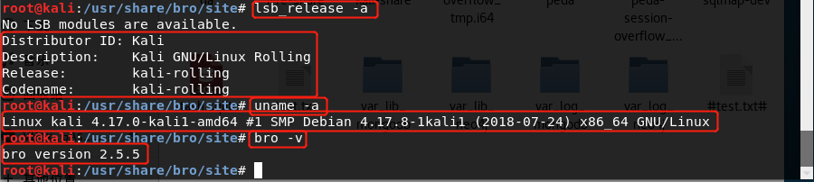

- 下载要分析数据包

  ```bash
  wget http://sec.cuc.edu.cn/huangwei/textbook/ns/chap0x12/attack-trace.pcap
  ```

- 新建文件 attack-trace , 防止数据放置混乱造成的文件名冲突等问题

  ```bash
  mkdir attack-trace 
  # 新建文件 attack-trace
  cp attack-trace.pcap attack-trace/
  # 将分析数据及结果复制该文件下
  ls -a /attack-trace
  # 查看操作是否成功
  ```

- 编辑 bro 配置文件 , 在 /etc/bro/site/local.bro 文件末尾添加 , 同时取消 SMB 模块注释:

  ```bro
  @load policy/protocols/smb
  @load frameworks/files/extract-all-files
  @load mytuning.bro
  ```

  截图如下:

  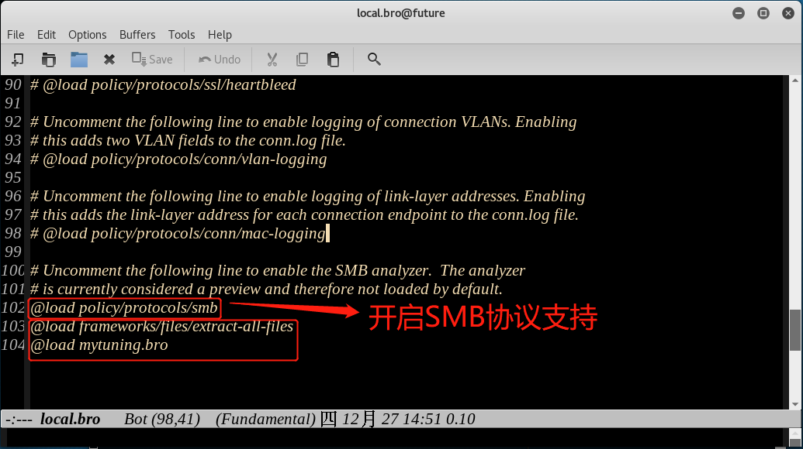

- 编辑 /etc/bro/site/mytuning.bro 文件, 添加以下内容:

  ```Bro
  redef ignore_checksums = T;
  # 重定义 ignore_checksums 的值
  redef Site::local_nets = { 192.150.11.0/24 };
  # 设置内网的网段等网络信息,防止产生不必要的警告信息 
  redef FTP::default_capture_password = T;
  # 显示是否加密
  ```

  截图如下:

  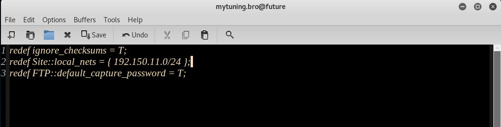


### Step 1 : 使用 Bro 进行分析

在 Terminal 中输入以下指令:

```bash
bro -r attack-trace.pcap /etc/bro/site/local.bro
```

返回结果如下:
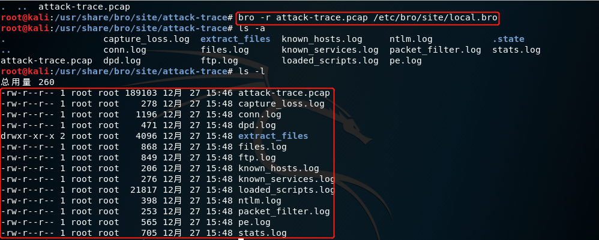

在attack-trace.pcap文件的当前目录下会生成一些`.log`文件和一个`extract_files`目录，在该目录下会发现有一个文件。将该文件上传到 VirusTotal , 结果如下:
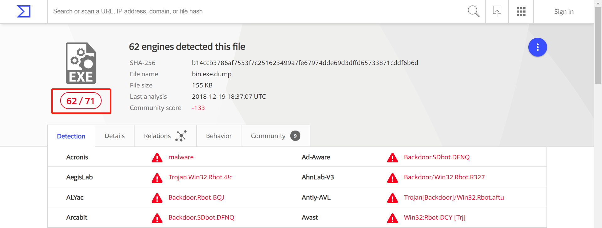
通过阅读`/usr/share/bro/base/files/extract/main.bro`的源代码

```bro
if ( ! args?$extract_filename )
        args$extract_filename = cat("extract-", f$last_active, "-", f$source,
                                    "-", f$id);

    f$info$extracted = args$extract_filename;
```

`FHUsSu3rWdP07eRE4l`是`files.log`中的文件唯一标识。通过查看`files.log`，发现该文件提取自网络会话标识（bro根据IP五元组计算出的一个会话唯一性散列值）为`CP0WpmULcjBpkDTQf`的FTP会话。

```bash
file extract-1240198114.648099-FTP_DATA-FHUsSu3rWdP07eRE4l
```

返回结果如下:

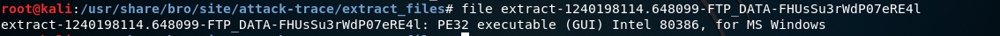

可以看出是 .exe 文件, for MS Windows。根据文件标识查找会话 ( 关联查询):

```bash
grep -R FHUsSu3rWdP07eRE4l | less
```

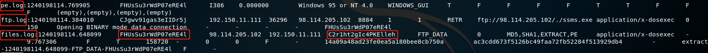

提取出 `files.log` 的会话标识, 继续查找:

```bash
grep -R C2r1ht2gIc4PKElleh | less
```

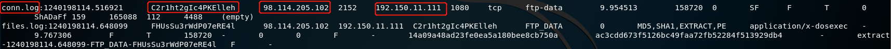

提取出会话, 结果就很明显了(ftp 传输文件)。如果想要查询更详细的信息, 使用以下指令:

```
grep ^#fields ftp.log | tr '\t' '\n'
# 查看 ftp.log 中的字段信息
bro-cut ts uid id.orig_h id.orig_p  id.resp_h id.resp_p user password command arg reply_code reply_msg -d < ftp.log
# 选择 fields 显示
```

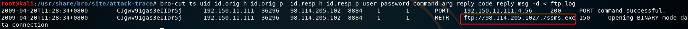

victim 下载了 `ssms.exe` 文件。


### Step 2:  bro hash上传脚本

内容就是将 hash (SHA-256) 传输到 VirusTotal(或者其他网站) , 并将返回的结果进行打印。原本想直接修改 get 的字段利用  VirusTotal 的 search 功能, 但是在官网上看到:

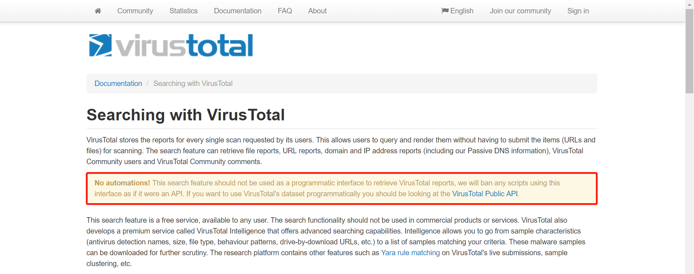

声明不要用自动化脚本使用 search 功能 ,  Virus Total 提供了公共的 API, 打开后页面如下：

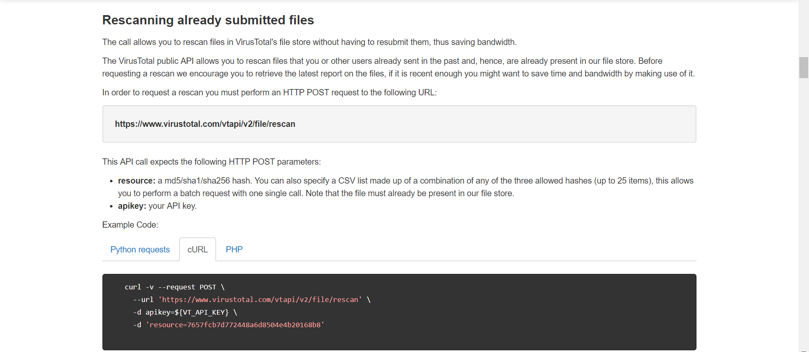

也就是说, 可以利用 curl、python 等调用 VirusTotal。后来发现 `policy/frameworks/files/detect-MHR.bro` , 官网上有一段描述:

```
Detect file downloads that have hash values matching files in Team Cymru’s Malware Hash Registry.
```

  后来尝试在 `/etc/bro/site/local.bro` 中增添 `@load policy/frameworks/files/detect-MHR.bro` 和直接使用指令 `bro -r attack-trace.pcap /usr/share/bro/policy/frameworks/files/detect-MHR.bro` , 发现和没有添加 `detect-MHR.bro` 没有区别。后来做了一下简单的调试:

```
emacs /usr/share/bro/policy/frameworks/files/detect-MHR.bro
```

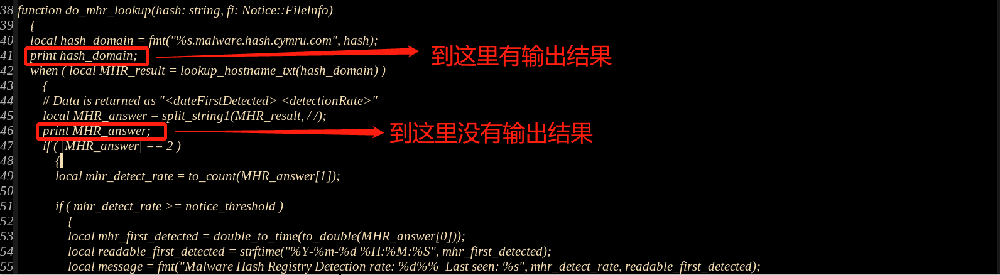

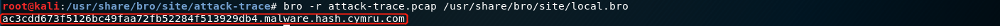

后来简单地查了一下 `when` 函数 , 主要用于异步执行 ,  增加 `timeout` 调试:

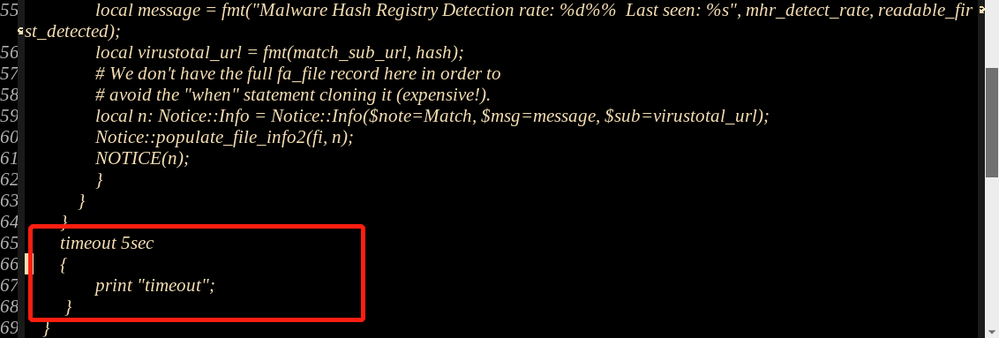

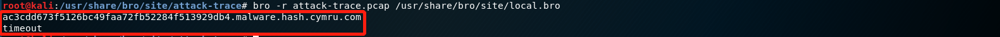

直接访问网址 `ac3cdd673f5126bc49faa72fb52284f513929db4.malware.hash.cymru.com` , 结果如下:

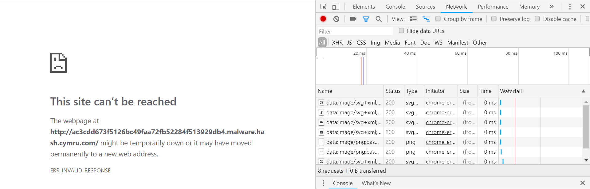

简单地看了一下 [TEAM CYMRU](https://www.team-cymru.com/mhr.html) , 画风是这样的:

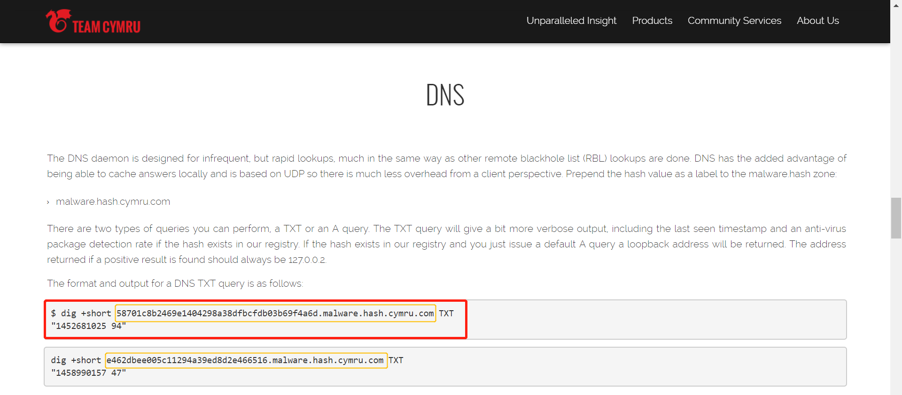

官网上也给出了 `hash值` + `malware.hash.cymru.com` 的命令格式 , 将上面的指令输入:

```bash
dig +short 85c54723deeab4e296eb5542712cd463fdac7527.malware.hash.cymru.com A
dig +short 58701c8b2469e1404298a38dfbcfdb03b69f4a6d.malware.hash.cymru.com TXT
```


和官网上提供的结果不一致。(我也不知道是怎么回事......) 现在 , 只能修改 `detect-MHR.bro` 的源代码中的 url 了。首先 , 必选找到能够提供返回正确结果的 url, 发现 `TEAM CYMRU`  MHR 的网站是这样的:

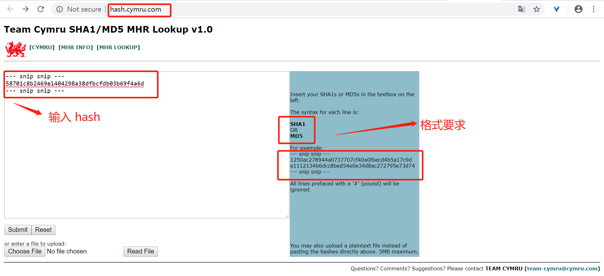

点击 `submit`, 返回结果如下:

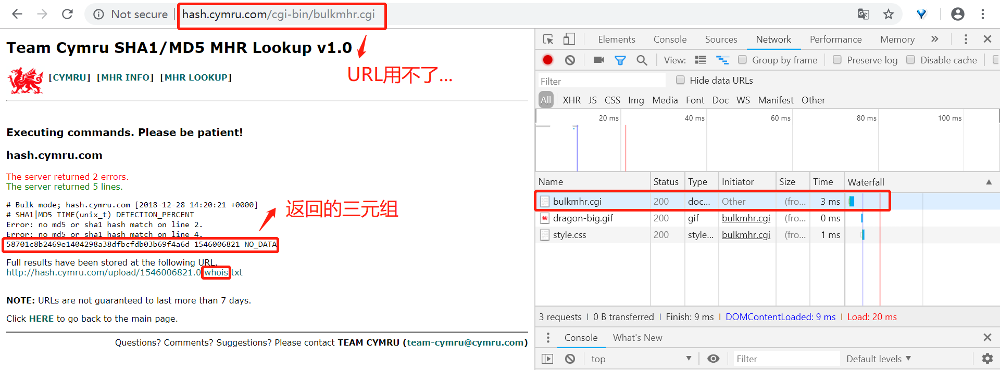

上图中返回的三元组和官网上提供的 `whois` 查询指令返回的结果相类似 , 第一个参数是上传的 hash , 第二个参数是 GMT 时间戳 , 第三个参数是在数据库中返回的查询结果。在看一下源代码:

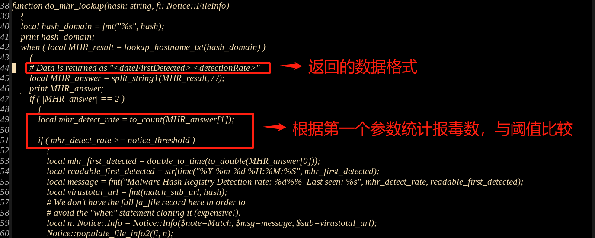

显然 , 和上面的网页上返回的结果不符 , **现在不知道如何找到能返回正确结果的 URL** ( **未解决** ) 


### 参阅

- [VirusTotal Public API](https://www.virustotal.com/en/documentation/public-api/#getting-file-scans)
- [VirusTotal search](https://www.virustotal.com/en/documentation/searching/)
- [policy/frameworks/files/detect-MHR.bro](https://www.bro.org/sphinx-git/scripts/policy/frameworks/files/detect-MHR.bro.html)
- [Try bro](http://try.bro.org/#/?example=modules-log-factorial)
- [Team Cymru SHA1/MD5 MHR Lookup v1.0](http://hash.cymru.com/)
