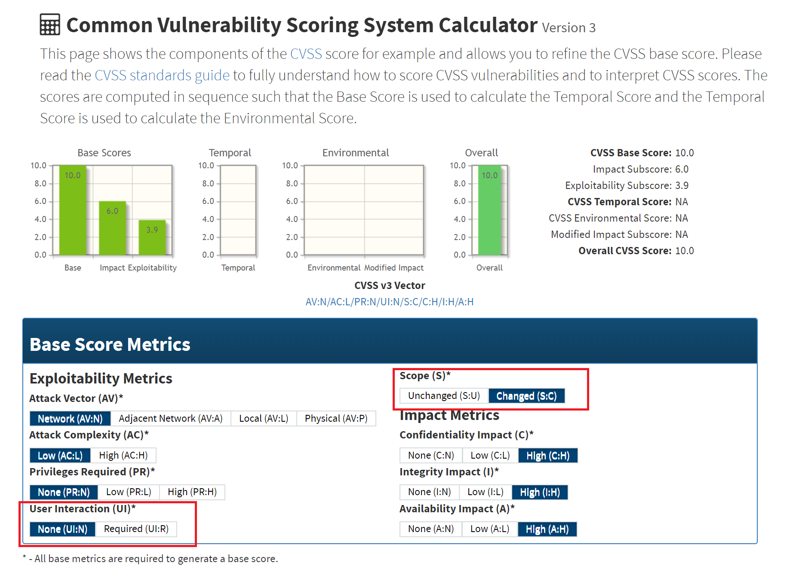

### CVSS与漏洞评分

---

> 作业内容：CVSS与漏洞评分实例讲解（高中低危漏洞各举一例） 


*Common Vulnerability Scoring System* (*CVSS*) : 通用漏洞评分标准 

简单摘取 CVSS 的一些关键信息，首先介绍了一下 metric 的分类：

> CVSS is composed of three metric groups, ==Base, Temporal, and Environmental, each consisting of a set of metrics==.
>
> The Base metric group represents the intrinsic characteristics of a vulnerability that are ==constant over time and across user environments==. It is composed of two sets of metrics: ==the Exploitability metrics and the Impact metrics==. 
>
> The Temporal metric group reflects the characteristics of a vulnerability that ==**may** change over time but not across user environments==. For example, the presence of a ==simple-to-use exploit kit== would increase the CVSS score, while the creation of an official patch would decrease it. 
>
> The Environmental metric group represents the characteristics of a vulnerability that are ==relevant and unique to a particular user's environment==. These metrics allow the scoring analyst to incorporate ==security controls== which may mitigate any consequences, as well as promote or demote the importance of a vulnerable system according to her business risk. 


接下来是每个 metric group 的计算公式：

> ```
> CVSS Base Score Equation
> 
> BaseScore = (.6*Impact +.4*Exploitability-1.5)*f(Impact)
>  
> Impact = 10.41 * (1 - (1 - ConfImpact) * (1 - IntegImpact) * (1 - AvailImpact))
> 
> Exploitability = 20 * AccessComplexity * Authentication * AccessVector
> 
> //  CVSS f(Impact) 说明漏洞不影响 CIA 时，漏洞的 Base Score 为 0。 
> f(Impact) = 0 if Impact=0; 1.176 otherwise 
>  
> 
> AccessComplexity = case AccessComplexity of
>                         high:   0.35
>                         medium: 0.61
>                         low:    0.71
>  
> Authentication   = case Authentication of
>                         Requires no authentication:                    0.704
>                         Requires single instance of authentication:    0.56
>                         Requires multiple instances of authentication: 0.45
>  
> AccessVector     = case AccessVector of
>                         Requires local access:    0.395
>                         Local Network accessible: 0.646
>                         Network accessible:       1
>  
>  // 信息安全的三大属性(CIA)
> ConfImpact       = case ConfidentialityImpact of
>                         none:             0
>                         partial:          0.275
>                         complete:         0.660
>  
> IntegImpact      = case IntegrityImpact of
>                         none:             0
>                         partial:          0.275
>                         complete:         0.660
>  
> AvailImpact      = case AvailabilityImpact of
>                         none:             0
>                         partial:          0.275
>                         complete:         0.660
>  
> CVSS Temporal Equation
>  
> TemporalScore = BaseScore 
>               * Exploitability 
>               * RemediationLevel 
>               * ReportConfidence
>  
> Exploitability   = case Exploitability of
>                         unproven:             0.85
>                         proof-of-concept:     0.9
>                         functional:           0.95
>                         high:                 1.00
>                         not defined           1.00
>                         
> RemediationLevel = case RemediationLevel of
>                         official-fix:         0.87
>                         temporary-fix:        0.90
>                         workaround:           0.95
>                         unavailable:          1.00
>                         not defined           1.00
>  
> ReportConfidence = case ReportConfidence of
>                         unconfirmed:          0.90
>                         uncorroborated:       0.95      
>                         confirmed:            1.00
>                         not defined           1.00
>  
> CVSS Environmental Equation
>  
> EnvironmentalScore = (AdjustedTemporal 
>                         + (10 - AdjustedTemporal) 
>                         * CollateralDamagePotential) 
>                      * TargetDistribution
>  
> AdjustedTemporal = TemporalScore recomputed with the Impact sub-equation 
>                    replaced with the following AdjustedImpact equation.
>  
> AdjustedImpact = Min(10, 
>                      10.41 * (1 - 
>                                 (1 - ConfImpact * ConfReq) 
>                               * (1 - IntegImpact * IntegReq) 
>                               * (1 - AvailImpact * AvailReq)))
>  
> CollateralDamagePotential = case CollateralDamagePotential of
>                                  none:            0
>                                  low:             0.1
>                                  low-medium:      0.3   
>                                  medium-high:     0.4
>                                  high:            0.5      
>                                  not defined:     0
>                                  
> TargetDistribution        = case TargetDistribution of
>                                  none:            0
>                                  low:             0.25
>                                  medium:          0.75
>                                  high:            1.00
>                                  not defined:     1.00
>  
> ConfReq       = case ConfidentialityImpact of
>                         Low:              0.5
>                         Medium:           1
>                         High:             1.51
>                         Not defined       1
>  
> IntegReq      = case IntegrityImpact of
>                         Low:              0.5
>                         Medium:           1
>                         High:             1.51
>                         Not defined       1
>  
> AvailReq      = case AvailabilityImpact of
>                         Low:              0.5
>                         Medium:           1
>                         High:             1.51
>                         Not defined       1
> ```

资料来源：https://nvd.nist.gov/vuln-metrics/cvss/v3-calculator


简要分析：

1) .  BaseScore 由三部分计算而来，Impact，Exploitability，f(Impact)。

- Impact 是由 CIA 决定，简单计算一下取值，最大为 $$10.00084536 (10.41 * (1 - 0.34 ^ 3))$$，最小值为 0。
- Exploitability 是由 AccessComplexity，Authentication，AccessVector组成，最大值为 $$ 9.9968\ (20*0.71* 0.704)$$
- f(Impact) 是由 Impact 决定，当 Impact 取 0 （CIA 都为 0）时，为 0；否则，会有一个 1.176 的权值。

在最终的计算公式中，Impact 的权重为 0.6，Exploitability 的权重为 0.4，CVSS 的基础分主要还是由 CIA 来定义。

2). TemporalScore 由四部分简单相乘得到，BaseScore，Exploitability，RemediationLevel，ReportConfidence。( **主观性较大** )

- BaseScore 上一步计算得到的基础分。
- Exploitability 建立在 **漏洞存在** 的基础之上，分为漏洞的**可用性未被证明**、**概念上可用**、**可用**（high、not define 不是很懂什么意思 ...）
- RemediationLevel (补救水平) 分为 **正式、临时、变通、不可用、未定义**。
- ReportConfidence 报告可信度，这个就不多说了 ......

3) . EnvironmentalScore 由 3 部分组成，AdjustedTemporal （TemporalScore recomputed）、CollateralDamagePotential（危害潜在性）、TargetDistribution（目标分布）


**问题 [1]** : 分析结果与实际操作结果不符。（**未解决**）**For Example** : 计算 Base Score最大值，结果如下：



如果按照公式分析，Impact  Subscore 和 Exploitability  Subscore 之和应该达到 9.99（接近10），上图中，两项之和只有 9.9。同时，在上图 Metric 中多出了 User Interaction（UI）* 和 Scope ( S )* 项，这两项之和可以达到0.1。公式与实际不符。


计算流程图：

> ### NVD CVSS Overall Score Decision Tree
>
> The CVSS Overall Score is part of the NVD and is not part of the CVSS standard.
>
> ```
>     (Calculate OverallScore)
>                 |
>                 |
>                 \/
> 	<BaseScore Defined?> ----No----> [OverallScore = "Not Defined"] -------------
>                 |                                                                   |
>                 |                                                                   |
>                Yes                                                                  |
>                 |                                                                   |
>                 |                                                                   |
>                 \/                                                                  |
>     [OverallScore = BaseScore]                                                      |
>                 |                                                                   |
>                 |                                                                   |
>                 \/                                                                  |
>      <EnvironmentalScore Defined?> --Yes--> [OverallScore = EnvironmentalScore] ----|
>                 |                                                                   |
>                 |                                                                   |
>                 No                                                                  |
>                 |                                                                   |
>                 |                                                                   |
>                 \/                                                                  |
>         <TemporalScore Defined?> ---Yes---> [OverallScore = TemporalScore] ---------|
>                 |                                                                   |
>                 |                                                                   |
>                 No                                                                  |
>                 |                                                                   |
>                 |                                                                   |
>                 \/                                                                  |
>        (Return OverallScore) <-------------------------------------------------------
> ```


#### CVSS v3.0 Ratings

> | Severity | Base Score Range |
> | :------: | :--------------: |
> |   None   |       0.0        |
> |   Low    |     0.1-3.9      |
> |  Medium  |     4.0-6.9      |
> |   High   |     7.0-8.9      |
> | Critical |     9.0-10.0     |


#### 漏洞举例

考虑到 CVSS 评分标准中有很多 **非客观度量**，这里就不再自己评分，而是使用较权威的 CVSS 漏洞评分例子 (使用的是 Base Score，评价标准是 CVSS v3.0 Rating)。这里只是简单地举例，漏洞的原理并不展开分析。

**高危**：

> ### 8. OpenSSL Heartbleed Vulnerability (CVE-2014-0160)
>
> #### 8.1. Vulnerability
>
> The (1) TLS and (2) DTLS implementations in OpenSSL 1.0.1 before 1.0.1g do not properly handle Heartbeat Extension packets, which allows remote attackers to obtain sensitive information from process memory via crafted packets that trigger a buffer over-read, as demonstrated by reading private keys, related to d1_both.c and t1_lib.c, aka the Heartbleed bug.
>
> #### 8.2. Attack
>
> A successful attack requires only sending a specially crafted message to a web server running OpenSSL. The attacker constructs a malformed "heartbeat request" with a large field length and small payload size. The vulnerable server does not validate that the length of the payload against the provided field length and will return up to 64 kB of server memory to the attacker. It is likely that this memory was previously utilized by OpenSSL. Data returned may contain sensitive information such as encryption keys or user names and passwords that could be used by the attacker to launch further attacks.
>
> #### 8.3. CVSS v2 Base Score: 5.0
>
> | Metric                 | Value   |
> | ---------------------- | ------- |
> | Access Vector          | Network |
> | Access Complexity      | Low     |
> | Authentication         | None    |
> | Confidentiality Impact | Partial |
> | Integrity Impact       | None    |
> | Availability Impact    | None    |
>
> #### 8.4. CVSS v3.0 Base Score: 7.5
>
> | Metric                 | Value     | Comments                                                     |
> | ---------------------- | --------- | ------------------------------------------------------------ |
> | Attack Vector          | Network   | The vulnerability is in a network service that uses OpenSSL. |
> | Attack Complexity      | Low       | An attacker needs to only find a listening network service to mount an attack. |
> | Privileges Required    | None      | An attacker requires no privileges to mount an attack.       |
> | User Interaction       | None      | No user access is required for an attacker to launch a successful attack. |
> | Scope                  | Unchanged | The **vulnerable component** is OpenSSL which is integrated with the network service, therefore no change in scope occurs during the attack. |
> | Confidentiality Impact | High      | Access to only some restricted information is obtained, but the disclosed information presents a direct, serious impact to the affected scope (e.g. the attacker can read the administrator's password, or private keys in memory are disclosed to the attacker). |
> | Integrity Impact       | None      | No information can be modified by the attacker.              |
> | Availability Impact    | None      | The attacker cannot affect availability through this attack  |

可以看到 心脏滴血，在 CVSS v2.0 的版本中只是一个中危漏洞，到了 v3.0版本中已经变成 高危漏洞。


**中危：**

> ### 12. Joomla Directory Traversal Vulnerability (CVE-2010-0467)
>
> #### 12.1. Vulnerability
>
> Directory traversal vulnerability in the ccNewsletter (com_ccnewsletter) component 1.0.5 for Joomla allows remote attackers to read arbitrary files via a .. (dot dot) in the controller parameter in a ccnewsletter action to index.php.
>
> #### 12.2. Attack
>
> A malicious HTTP request that contains the vulnerable component 'com_ccnewsletter', and proper series of '../' entries allows an attacker the ability to change from the directory where the webserver is installed to any directory on the file system of the host OS. Depending on the privileges of the web application server, an attacker would be able to view the contents of any file in the directory searched. Scope is changed due to the ability of the vulnerable component to access the affected system outside of the controlling authoritative component.
>
> #### 12.3. CVSS v2 Base Score: 5.0
>
> | Metric                 | Value   |
> | ---------------------- | ------- |
> | Access Vector          | Network |
> | Access Complexity      | Low     |
> | Authentication         | None    |
> | Confidentiality Impact | Partial |
> | Integrity Impact       | None    |
> | Availability Impact    | None    |
>
> #### 12.4. CVSS v3.0 Base Score: 5.8
>
> | Metric                 | Value   | Comments                                                     |
> | ---------------------- | ------- | ------------------------------------------------------------ |
> | Attack Vector          | Network |                                                              |
> | Attack Complexity      | Low     |                                                              |
> | Privileges Required    | None    |                                                              |
> | User Interaction       | None    |                                                              |
> | Scope                  | Changed | It is not clear from the publicly available information if Joomla's own authorization authority is enabled or plays a role here. For this vulnerability we are assuming that Joomla has its own separate authorization authority and the attacker is able to break out from it and access files on the file system with privileges of web server which has a separate authorization authority. |
> | Confidentiality Impact | Low     | The attacker is able to read files to which web server has access. |
> | Integrity Impact       | None    | There is no indication that the files can be modified as well. |
> | Availability Impact    | None    | No availability impact.                                      |


**低危：**

> ### 3. SSLv3 POODLE Vulnerability (CVE-2014-3566)
>
> #### 3.1. Vulnerability
>
> The SSL protocol 3.0, as used in OpenSSL through 1.0.1i and other products, uses nondeterministic CBC padding, which makes it easier for man in the middle attackers to obtain plaintext data via a padding-oracle attack, aka the "POODLE" issue.
>
> #### 3.2. Attack
>
> A typical attack scenario is that a victim has visited a web server and her web browser now contains a cookie that an attacker wishes to steal. For a successful attack, the attacker must be able to modify network traffic between the victim and this web server, and both victim and system must be willing to use SSL 3.0 for encryption.
>
> A typical attack starts by the attacker tricking the victim into visiting a web site containing malicious code that then runs on the victim's web browser. Same Origin Policy (SOP) restrictions in web browsers prevent this code from directly accessing the cookie the attacker is trying to steal, but HTTP requests that the code sends to the web server automatically have the cookie added, and this behavior is used in the attack.
>
> The malicious code sends an HTTP request that guesses the value of the first byte of the cookie, and positions this byte in a specific location. The attacker modifies the encrypted HTTP request such that this byte is used as a padding value. If the server accepts the modified request, the value guessed was correct; if not, the code guesses a different value in a new request. This process is repeated until the entire cookie is disclosed.
>
> #### 3.3. CVSS v2 Base Score: 4.3
>
> | Metric                 | Value   |
> | ---------------------- | ------- |
> | Access Vector          | Network |
> | Access Complexity      | Medium  |
> | Authentication         | None    |
> | Confidentiality Impact | Partial |
> | Integrity Impact       | None    |
> | Availability Impact    | None    |
>
> #### 3.4. CVSS v3.0 Base Score: 3.1
>
> | Metric                 | Value     | Comments                                                     |
> | ---------------------- | --------- | ------------------------------------------------------------ |
> | Attack Vector          | Network   | The attack is conducted over a network. Note that the attack can take place at any point between the victim and web server over which the network traffic is routed. The value is therefore Network rather than Adjacent Network; the latter is only used for attacks where the attacker must be on the same physical network (or equivalent). |
> | Attack Complexity      | High      | This is a man in the middle attack, and therefore complex for the attacker to perform. Privileges Required None An attacker requires no privileges to mount an attack. User Interaction Required The victim must be tricked into running malicious code on her web browser. |
> | Privileges Required    | None      | An attacker requires no privileges to mount an attack.       |
> | User Interaction       | Required  | The victim must be tricked into running malicious code on her web browser. |
> | Scope                  | Unchanged | The **vulnerable component** is the web server because it insecurely responds to padding errors in a way that can be used to brute force encrypted data. The **impacted component** is also the web server because the cookie information disclosed is part of its authorization authority. |
> | Confidentiality Impact | Low       | The attack discloses cookie information that the attacker should not have access to. |
> | Integrity Impact       | None      |                                                              |
> | Availability Impact    | None      |                                                              |

> 资料来源：https://www.first.org/cvss/examples#3-4-CVSS-v3-0-Base-Score-3-1