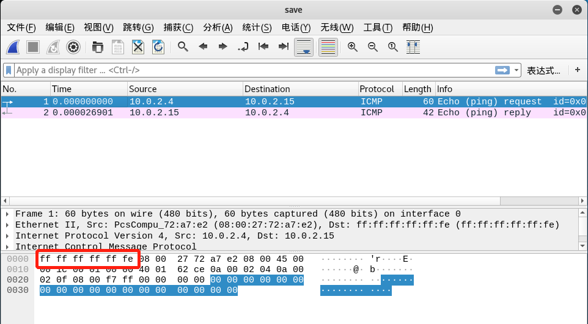

### 网络监听


**实验[1]：检测局域⽹中的异常终端** 


**网络环境**：

 使用 2 台 kali 虚拟机，网络模式均使用**内网模式**

 开启混杂模式主机（**promisc**）IP : **10.0.3.15**

 检测混杂模式主机（**detector**）IP : **10.0.3.2**  


#### Basis

- **scapy** 基础语法
- 了解 linux 下的伪广播、多播地址 ( [来源](http://blog.51cto.com/wushank/1121361) )


#### *Step 0* : 准备工作

- **连通性测试**


- **detector 尝试发送错误测试数据包**

```
pkt = Ether(dst = 'ff:ff:ff:ff:ff:fe')/IP(dst = '10.0.3.15')/ICMP()
ret = sr(pkt,timeout = 5)
ret
```


显然数据包并未被回复。（这里需要重补一张图，原因在下文）


#### *Step 1*: promisc 开启混杂模式
`````
 ip link set eth0 promisc on
`````
`````
 ip link
`````


#### *Step 2* : 使用 scapy 构造发送的数据包

```
pkt = Ether(dst = 'ff:ff:ff:ff:ff:fe')/IP(dst = '10.0.3.15')/ICMP()
ret = sr(pkt,timeout = 5)
ret 
```


**实验结果出错：**


选择其他方式发送数据包，备选函数 is_promisc ()、promiscping() ：


**is_promisc()**
```
 help(is_promisc)
```

```
 Help on function is_promisc in module scapy.layers.12：

 is_promisc(ip,fake_bcast='**ff:ff:00:00:00:00**',**kargs)
   Try to guess if target is in Promise mode. The target is provided by its ip.
```


结果表明开启了混杂模式。


**promiscping()**
`````
 help(promiscping)
`````

`````
 Help on function promiseping in module scapy.layers.12：

 promiseping(net, timeout=2, fake_bcast = '**ff：ff：ff：ff：ff：fe**', **kargs)
 	Send  ARP  who-has  requests  to  determine  which  hosts  are  in  promiscuous  mode 
 promiseping(net, iface=conf.iface)
`````


**问题 [1] : 为什么使用一般方法构造的数据包不能 ping 通目标主机？这些 ping 包有什么不同？(在 *Step 3* 中解决)**


#### *Step 3* :  抓包观察实验结果

作业要求比较普通的 ICMP 包 和  promiscping() 函数发送的数据包有什么不同之处？这里简单回答，不再做截图比较。

- **协议**：promiscping( ) 并未使用 ICMP , 而是使用 ARP 协议。
- **目的 MAC**：promiscping( ) 使用 Des MAC 是 FF:FF:FF:FF:FF:FE，PING 则使用正常 MAC。 

  
  

**下面来解答问题 [1]:**


**操作步骤：detector 使用 以下命令分别发送数据包，promisc 使用 tshark 记录抓包结果：** 

`````
 ret = promiscping('10.0.3.15')

 pkt = Ether(dst = 'ff:ff:ff:ff:ff:fe')/IP(dst = '10.0.3.15')/ICMP()
 ret = sr(pkt,timeout = 5)

 ret = is_promisc('10.0.3.15')
`````

抓取的数据包如下：


​	1). **promiscping ( ) , Destination 为 ff:ff:ff:ff:ff:fe，和通过 help ()  看到的结果相同。**

​	2). **普通方法构造的 ICMP 数据包，Destination 为 Broadcast ( ff:ff:ff:ff:ff:ff )，Info 显示为 畸形数据包。**

​	3). **is_promisc ( )，Destination 为 ff:ff:00:00:00:00，符合 help ( )结果。**


 **1)、3)** 并没有什么特别需要注意的地方，完全符合实验预期结果。ARP 的 返回数据包都使用 自己 的 MAC 地址。现在观察 **2)（畸形数据包的内容）**


正常 ICMP:


 

在 wireshark 官网的 [Appendix](https://www.wireshark.org/docs/wsug_html_chunked/AppMessages.html#_malformed_packet) 中：

> ### A.1.1. [Malformed Packet]
>
> Malformed packet means that the protocol dissector can’t dissect the contents of the packet any further. There can be various reasons:
>
> - *Wrong dissector*: Wireshark erroneously has chosen the wrong protocol dissector for this packet. This will happen e.g. if you are using a protocol not on its well known TCP or UDP port. You may try Analyze|Decode As to circumvent this problem.
> - *Packet not reassembled*: The packet is longer than a single frame and it is not reassembled, see [Section 7.8, “Packet Reassembly”](https://www.wireshark.org/docs/wsug_html_chunked/ChAdvReassemblySection.html)for further details.
> - *Packet is malformed*: The packet is actually wrong (malformed), meaning that a part of the packet is just not as expected (not following the protocol specifications).
> - *Dissector is buggy*: The corresponding protocol dissector is simply buggy or still incomplete.
>
> Any of the above is possible. You’ll have to look into the specific situation to determine the reason. You could disable the dissector by disabling the protocol on the Analyze menu and check how Wireshark displays the packet then. You could (if it’s TCP) enable reassembly for TCP and the specific dissector (if possible) in the Edit|Preferences menu. You could check the packet contents yourself by reading the packet bytes and comparing it to the protocol specification. This could reveal a dissector bug. Or you could find out that the packet is indeed wrong.


对比两者，发现 ff : ff : ff : ff : ff : fe 被作为 padding 附在 Length 字段的后面，而 Destination 变为 ff : ff : ff : ff : ff : ff（Broadcast），显然，数据包被做过手脚....... 符合 Appendix 中第 3 条，数据包的构造是畸形的。


**问题[2] : 那如何构造一个正常的数据包？（未解决）**

个人认为应该是不行的，注意发送 Malformed packet 的一个细节：


这里的 WARNING 已经提示 Using broadcast , 也就是 Destination MAC 已经被替换为 Broadcast , ff : ff : ff : ff : ff : fe 将被放在 padding 字段，当解析到 Protocal 字段，解析会出错。也就是说永远都构造不出一个正常的 packet。

**问题解决：**
之前观察到了畸形数据包, 并提出猜测, ` WARNING 已经提示 Using broadcast , 也就是 Destination MAC 已经被替换为 Broadcast , ff : ff : ff : ff : ff : fe 将被放在 padding 字段`,猜测是没有问题的, 但是使用 scapy 完全可以构造一个正常的数据包（问题[2] 的回答是不完全正确的）,引用一段[评论](https://stackoverflow.com/questions/18625072/understanding-the-scapy-mac-address-to-reach-destination-not-found-using-broad)：

```
Most people encountering this issue are incorrectly using send() (or sr(), sr1(), srloop()) instead of sendp() (or srp(), srp1(), srploop()). For the record, the "without-p" functions like send() are for sending layer 3 packets (send(IP())) while the "with-p" variants are for sending layer 2 packets (sendp(Ether() / IP())).

If you define x like I do below and use sendp() (and not send()) and you still have this issue, you should probably try with the latest version from the project's git repository (see https://github.com/secdev/scapy).

I've tried:

>>> x = Ether(src='01:00:0c:cc:cc:cc', dst='00:11:22:33:44:55')
>>> ls(x)
dst        : DestMACField         = '00:11:22:33:44:55' (None)
src        : SourceMACField       = '01:00:0c:cc:cc:cc' (None)
type       : XShortEnumField      = 0               (0)
>>> sendp(x, iface='eth0')

Sent 1 packets.
At the same time I was running tcpdump:

# tcpdump -eni eth0 ether host 00:11:22:33:44:55
tcpdump: verbose output suppressed, use -v or -vv for full protocol decode
listening on eth0, link-type EN10MB (Ethernet), capture size 65535 bytes
12:33:47.774570 01:00:0c:cc:cc:cc > 00:11:22:33:44:55, 802.3, length 14: [|llc]
```
也就是说问题的关键是 sr 的使用,sr 是用在第 3 层 , 正确的方法应该是使用 srp ,srp 才是用在第 2 层的函数, scapy 的文档上也解释了两者的差别：
```
Sending packets
Now that we know how to manipulate packets. Let’s see how to send them. The send() function will send packets at layer 3. That is to say, it will handle routing and layer 2 for you. The sendp() function will work at layer 2. It’s up to you to choose the right interface and the right link layer protocol. send() and sendp() will also return sent packet list if return_packets=True is passed as parameter.
```
现在，重新构造数据包进行实验（sr -> srp）：
```
 pkt = Ether(dst = 'ff:ff:ff:ff:ff:fe')/IP(dst = '10.0.3.15')/ICMP()
 ret = srp(pkt,timeout = 5)
 ```
 结果如下：

实验成功, 问题成功解决！

**关于 IPX 解析问题：**
稍微梳理了一下思路，大致是这么一个过程：
- EtherType 字段为 0x0001 < 1500, 解析为EtherLength
- 读取后两个字节为 0xffff, 根据下表解析为 Novell raw IEEE 802.3
```
Frame type	               Ethertype or length	    Payload start two bytes
Novell raw IEEE 802.3  	       ≤ 1500	                    0xFFFF
```
- 根据下图解析为 IPX

