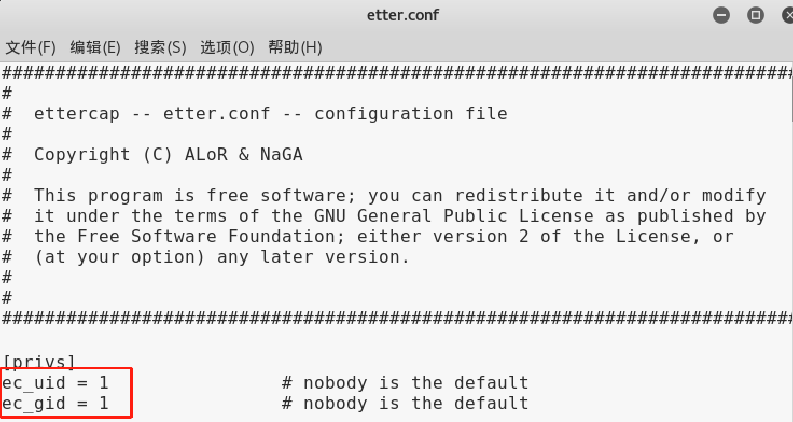

### 网络监听 

---

**实验[2]：交换式局域⽹的⼝令嗅探** 

**实验内容简化：使用 Ettercap 实现双向 arp 欺骗 ( 降低了作业难度 )** 

、、、、、、、、、、、、、、、、、、、、、、、、、、、、、、、

**网络环境：**

- Attacker :  内网模式    IP  10.0.3.13     MAC  08:00:27:da:13:0b

- Victim :     内网模式     IP  10.0.3.15     MAC  08:00:27:9d:60:bf

- Gateway : 内网模式     IP  10.0.3.2       MAC  08:00:27:fd:31:c5

  ​		   NAT网络     IP  10.0.2.4       MAC  08:00:27:1c:f2:96

   

#### *Step 0* : 连通性测试

**Attacker ping :**

 

**Victim ping :** 

**Gateway ping :**

三者及外界可以相互连通。

#### *Step 1*: ARP记录

**Attacker arp :**

**Victim arp :**

**Gateway arp :**

#### *Step 2 :* 双向 ARP欺骗

在 Attacker 命令行中输入：

> leafpad /etc/ettercap/etter.conf 

修改 ettercap 的权限，否则，后面的 hostlist 等文件会因为权限不够不能打开。

在 Attacker 命令行中输入：

> ettercap -G

打开 ettercap 的图形化界面。接下来就是简单的界面操作

- 点击左上角 "sniff" => 选择eth0 (10.0.3.13)
- Host => Scan for hosts，扫描当前网络中的所有主机。
- Host => Host list，扫描到的主机列表

列表如下：

添加目标：

- Mitm->ARP Poisoning，选择参数，Sniff remote connections , 开始攻击。

#### *Step 3 :* 查看毒化 ARP

**Victim arp :**

**Gateway arp :**

发现 受害者主机 和 网关 相互之间的 MAC 均变为 攻击者主机的 MAC。（这里就不再抓包观察了......）