## Port scanning 

---

**实验内容**：自己动手编程实现并讲解TCP connect scan/TCP stealth scan/TCP XMAS scan/UDP scan

 

**实验环境**：Kali 虚拟机 ，扫描者 IP : **10.0.3.15**，被扫描者 IP：**10.0.3.2**，两者在同一网段。


**连通性测试**：scanner ping victim

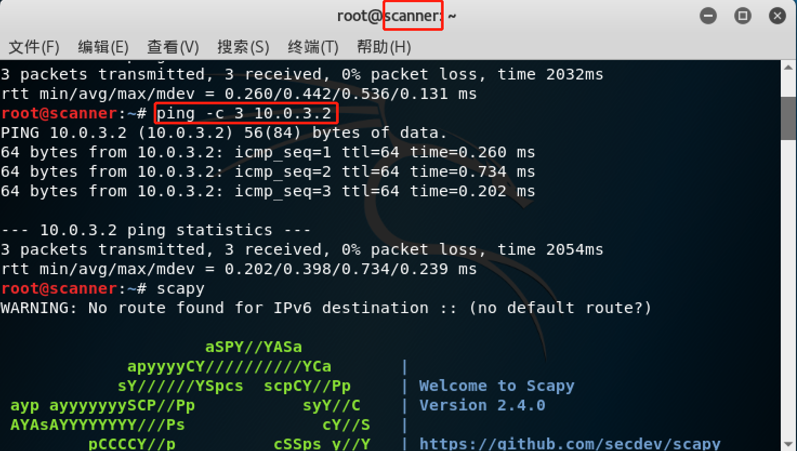


#### **BASIS** 

- **IANA 注册端口号**

  **(1) 公用端口：0 ~ 1023**

  **(2) 注册端口：1024 ~ 49151**

  **(3) 动态 或 私有端口：49152 ~ 65535**

- **端口状态**

  **(1) 开放：应用或服务监听该端口**

  **(2) 关闭：无应用或服务监听该端口**

  **(3) 被过滤：报⽂过滤程序监听该端口** 

  **可利用点：端口的不同状态都有属于自己的应答规则，可以根据应答结果判断端口所处的状态。**

- **扫描方式**

  **(1) 开放扫描   举例：TCP connection scan、UDP scan**

  **(2) 半开放扫描   举例：TCP SYN scan、TCP 间接扫描**

  **(3) 隐蔽扫描  举例：TCP FIN scan、TCP Xmas scan、TCP Null scan、分段扫描、ACK 扫描、IDLE扫描**


- **TCP.flags 过滤：根据 flags 的有效位位置，直接进行 and 操作**

  **(1) 判断 SYN：packet.flags & 0x00000010 ，scapy 简写 "S"（SYN）**

  **(2) 判断 RST：packet.flags & 0x00000100，scapy 简写 "R" （RST）**

  **(3) 判断 ACK：packet.flags & 0x00010000，scapy 简写 "A" （ACK）**

  **(4) 判断 ACK + SYN : packet.flags & 0x00010010，scapy 简写 "AS"（ACK SYN）** 

  **(5) 判断 ACK + RST：packet.flags & 0x00010010，scapy 简写 "AR"（ACK RST）**

  **(6) 判断 FIN + PSH + URG : packet.flags & 0x00101001，scapy 简写 "FPU"**


- **[ICMP](https://en.wikipedia.org/wiki/Internet_Control_Message_Protocol)**  type 3 （Destination Unreachable）

  | 3 – Destination Unreachable |                                                              |
  | --------------------------- | ------------------------------------------------------------ |
  | 1                           | Destination host unreachable                                 |
  | 2                           | Destination protocol unreachable                             |
  | 3                           | Destination port unreachable                                 |
  | 4                           | Fragmentation required, and [DF flag](https://en.wikipedia.org/wiki/IPv4_packet) set |
  | 5                           | Source route failed                                          |
  | 6                           | Destination network unknown                                  |
  | 7                           | Destination host unknown                                     |
  | 8                           | Source host isolated                                         |
  | 9                           | Network administratively prohibited                          |
  | 10                          | Host administratively prohibited                             |
  | 11                          | Network unreachable for [ToS](https://en.wikipedia.org/wiki/Type_of_service) |
  | 12                          | Host unreachable for [ToS](https://en.wikipedia.org/wiki/Type_of_service) |
  | 13                          | Communication administratively prohibited                    |
  | 14                          | Host Precedence Violation                                    |
  | 15                          | Precedence cutoff in effect                                  |


- **netcat 参数详解：监听 udp 端口时会使用**

  ```
  options:
  	-u               		UDP mode
  	-l 						listen mode，for inbound connects
  	-p port 				local port number
  ```


**端口测试**:scanner  Kali 命令行（flags ”S“指 SYN，dport 指定扫描端口范围）：

```
ans,unans = sr(IP(src = '10.0.3.15' ,dst = '10.0.3.2')/TCP(flags = 'S',dport = (0,65535)))
```

victim 开启 tshark 抓包（过滤了 DNS 和 arp 数据包）:

```
tshark -i eth1 -f "host 10.0.3.15 and not port 53 and not arp" -w 002.cap
```

注意：上述指令直接指定了过滤端口 53（DNS），因此 53 端口相当于经过了人工过滤。结果如下：

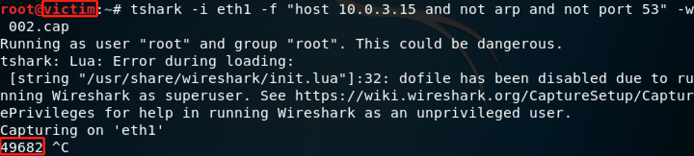

共发了 65536 个数据包，实际抓到 49682 / 2 个数据包。剩下的应该是被过滤。(这里存疑，因为上述截图使用了 ctrl + C 中断了抓包过程，可能有些数据包还没有被抓到，剩下的很有可能不是被过滤)

scanner 查看扫描结果：

```
ans.nsummary(lfilter = lambda (s,r): (r.haslayer(TCP) and (r.getlayer(TCP).flages & 2))))
```

实验结果为空。进一步验证，wireshark 打开抓包结果：

```
wireshark 002.cap
```

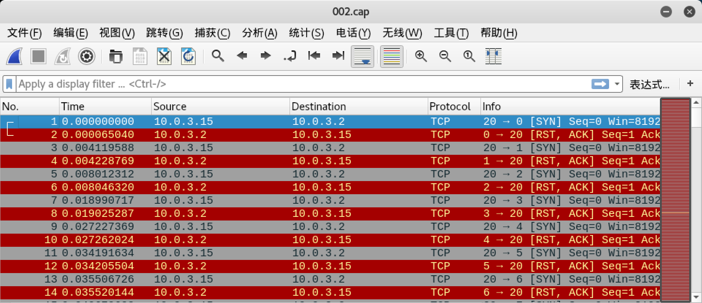

看到右边框，初步判断，大概是没有 ACK + SYN的数据包了...... 设置过滤规则：

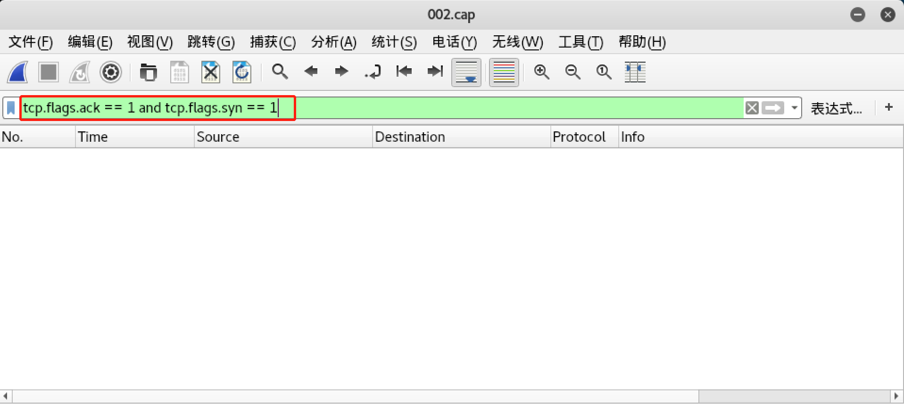

结果没有数据包。scanner 用 nmap 扫描，结果还是没有开放端口。为了更好的观察实验结果，有以下两种选择：

- [x] victim 开启一些服务，使一些端口处于 open 状态。
- []更换有所需端口的 victim。

选择第一种方案。


**开启端口：**

开启 80 端口（TCP  开放）：

```
systemctl start apache2
```

nmap 扫描：

```
nmap -p 80 10.0.3.2
```

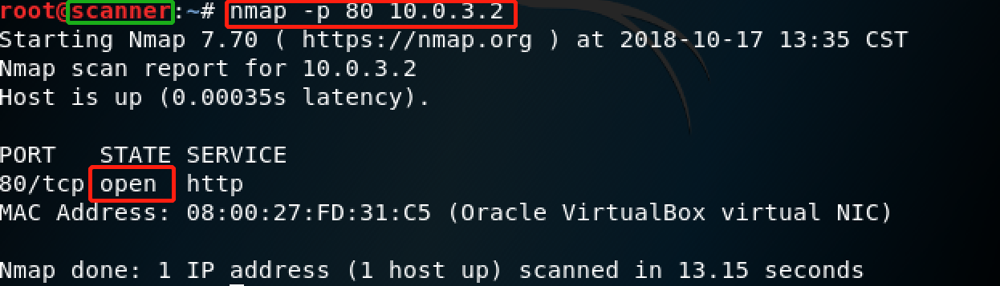


开启 53 端口（UDP  开放）：

```
iptables -A INPUT -p udp --dport 53 -j ACCEPT
```

此时只是开启了端口，无应用程序监听。nmap 扫描：

```
nmap -sU 53 10.0.3.2
```

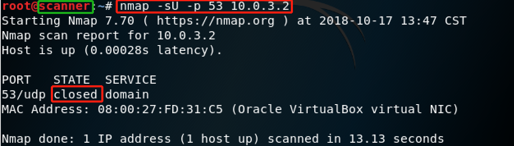

victim 使用 netcat 监听 53 端口：

```
nc -lu -p 53
```

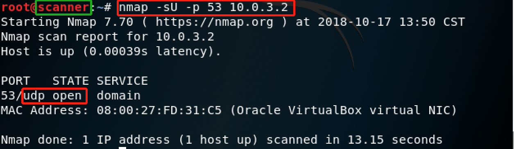


开启 56 端口（TCP 过滤）:

```
nc -l -p 56
```

设置 56 端口设置过滤规则： 

```
iptables -A INPUT -p tcp --dport 56 -j DROP
```

nmap 扫描：

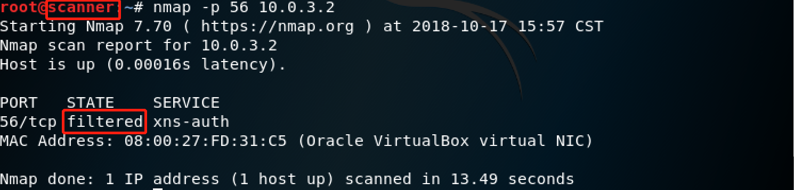


#### TCP connect scan

**扫描过程：**

（1）Open

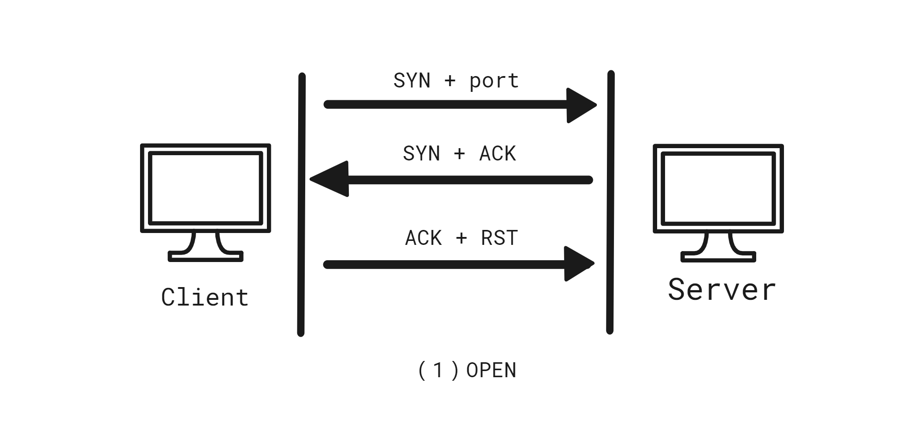

（2）Closed

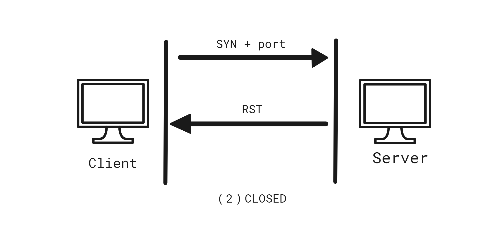（3） Filtered

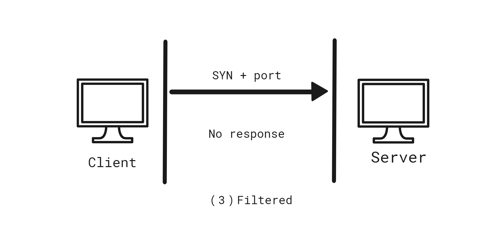

**扫描规则：**

Client 作为扫描者，首先发送一个 SYN 包( TCP 建立连接请求)，同时指定要扫描的端口。Server 作为被扫描者，收到建立连接的请求，会返回 SYN + ACK 的数据包。之后，Client 发送 ACK 数据包，同时设置 RST 字段关闭连接。


**实验端口：** http 80 open、ftp 21 closed、56  filtered 

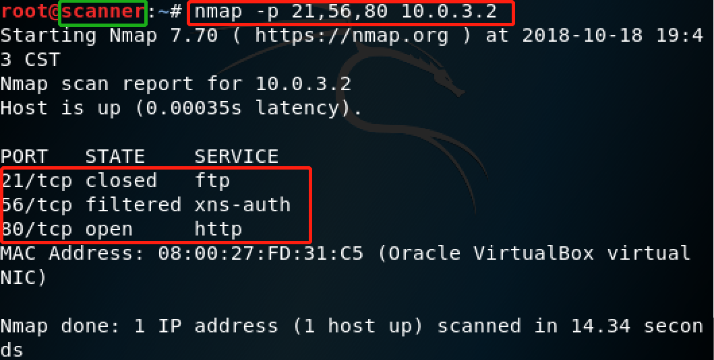


**scapy检测：**

```python
ans,unans = sr(IP(dst = '10.0.3.2')/TCP(flags = 'S',dport = [80,56,21])，timeout = 10)
ans,unans
ans.nsummary()
unans.nsummary()
# 过滤出 open 的数据包
ans.nsummary(lfilter = lambda (s,r):r.haslayer(TCP) and (r.getlayer(TCP).flags & 2))
```


到这里，TCP connect scan 并没有完成，以上是 TCP connect scan ( TCS ) 和 TCP stealth scan ( TSS ) 的相同部分；之后，TCS 中的 Client 还会发送一个 flags 为 “AR” 的数据包，而 TSS 中的 Client 会发送一个 flags 为 “ R ”的数据包，在三次握手之前结束连接。之后的过程会在 python 的代码中体现。


**编程测试结果：**

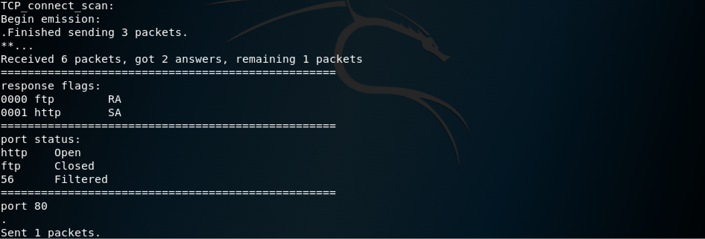


#### TCP stealth scan

**扫描过程：**

（1）Open

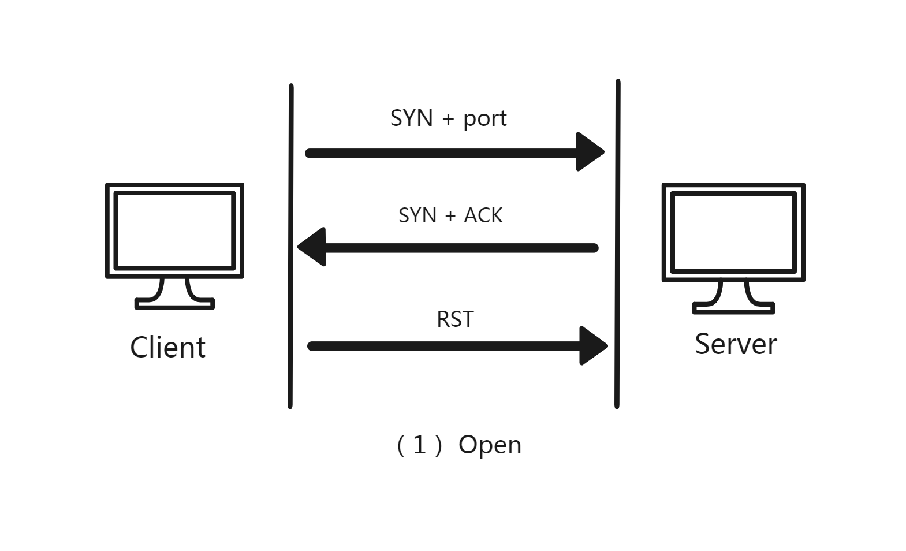

（2）Closed


（3）Filtered


**scapy检测：**已经在 TCP connection scan （TCS）中提到过，之后会在代码中一并实现。


**编程测试结果：**


#### UDP scan

**扫描过程：**

(1) Open

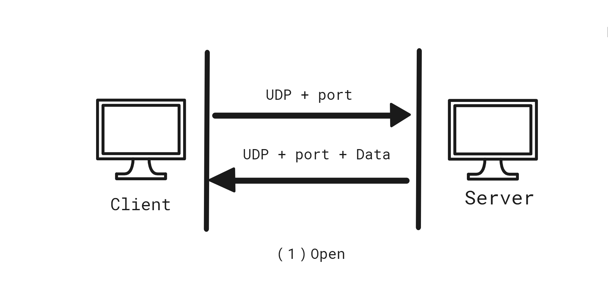

(2) Closed or Filtered

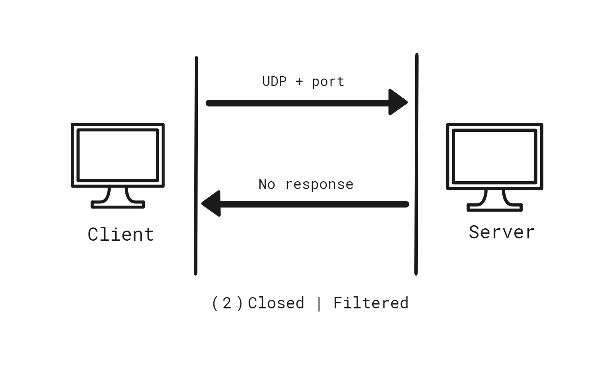

按照课件上，Closed 和 Filtered 应该是不可区分的，但是按照 [推荐阅读](https://resources.infosecinstitute.com/port-scanning-using-scapy/) 中，Closed 和 Filtered 是可以区分的，通过返回的 ICMP 报文的 type 字段 和 code 字段，code 为 3 表示主机不可达，type 为 [1,2,9,10,13]时，表示网络中的一些情况导致数据包的丢失，属于 filtered 的状态。当 type 为 3 时，表示 port unreachable，属于 closed 的状态。


**实验端口：** ftp 21 closed、56  open。


**问题[1] .** 使用 netcat 监听 UDP 端口， 发现 scanner 直接发送 UDP 数据包没有响应，必须要手动回复数据包，并且回复之后，netcat 的监听状态会自动断开，截图如下:

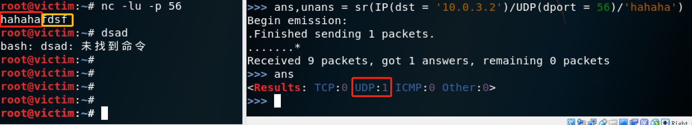

**上图解释：** 左边的虚拟机 **[1]** 开启 56 端口的 UDP 监听。右边的虚拟机 **[2]** 向 56 端口发送一个内容为 "hahaha" 的UDP 数据包，**[1]** 上显示 “hahaha”；在 **[1]** 的命令行中输入 "fdsf"，**[2]** 成功抓取数据包，**[1]** 同时退出了对 56 端口的监听。~~也就是说，netcat 并不是很实用。~~现在主要问题是保证 56 端口数据回复的 udp 数据包的及时性。


**问题 [1] 解决**：[参阅](https://github.com/CUCCS/2018-NS-Public-xaZKX/pull/4#issuecomment-430242698)，了解到 netcat 可以进行文件传输，可以让监听者在收到 UDP 数据包时，以文件内容构造一个 UDP 的数据包，模拟服务器行为。

创建文件，开启监听，scapy 发包，返回结果：

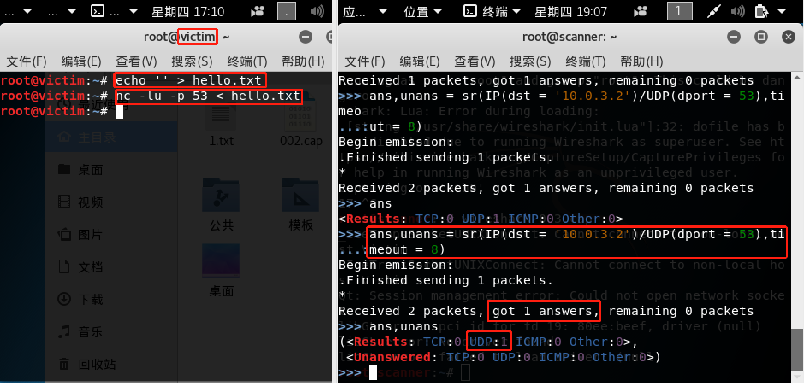

tshark 抓取该 udp 数据包，wireshark 分析：

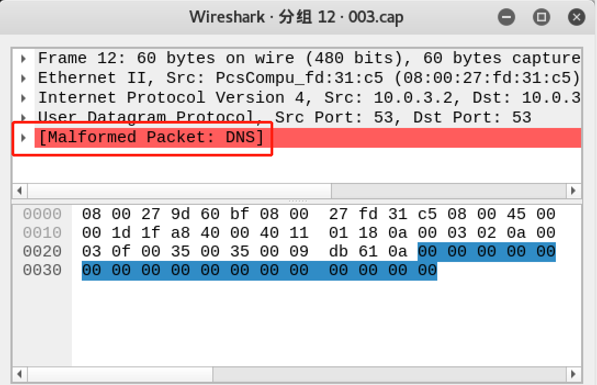

是一个畸形的 DNS 数据包，后面的 padding 不知道是如何附加上去的......

 

**scapy 检测**：

```
ans,unans = sr(IP(dst = '10.0.3.2')/UDP(dport = 53))
ans.nsummary(),unans.nsummary()
```

检测结果上图已有体现。


**编程测试结果：**

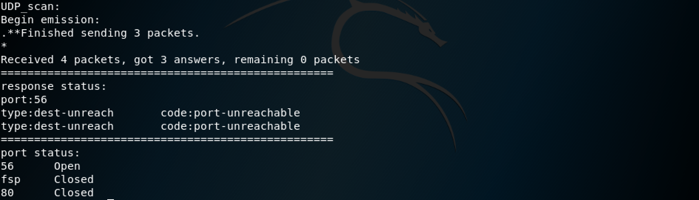


#### TCP XMAS scan

**扫描过程：**

（1）Open or Filtered :

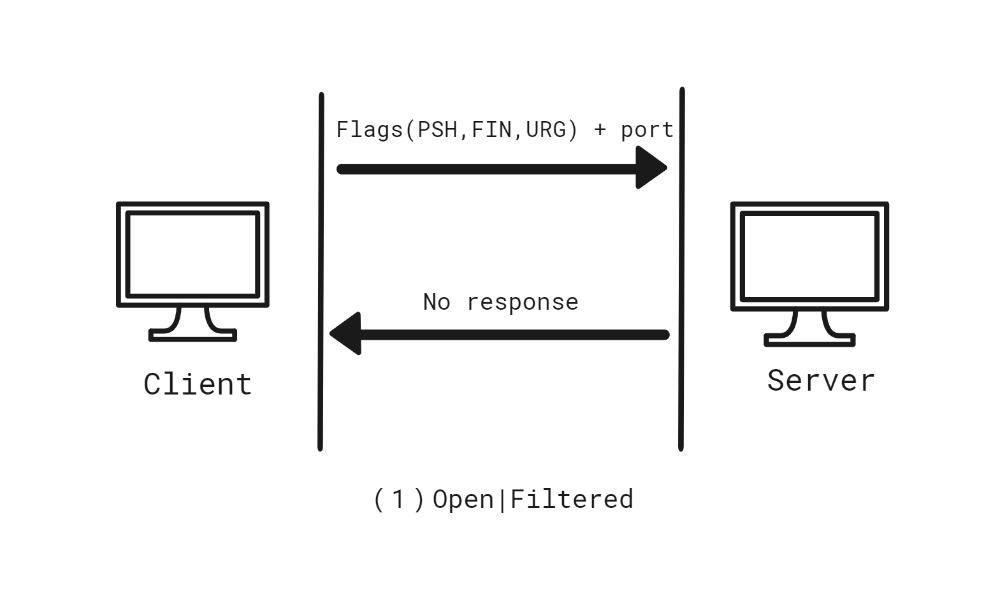

（2）Closed：

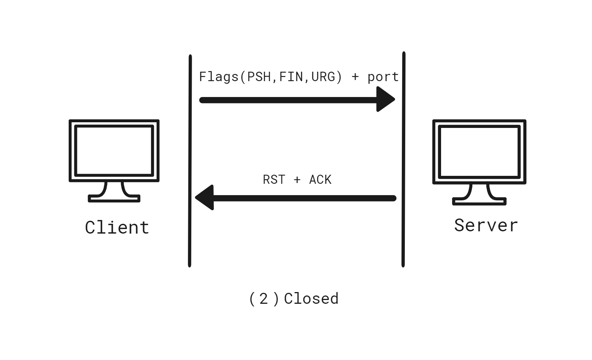

（3）Filtered：

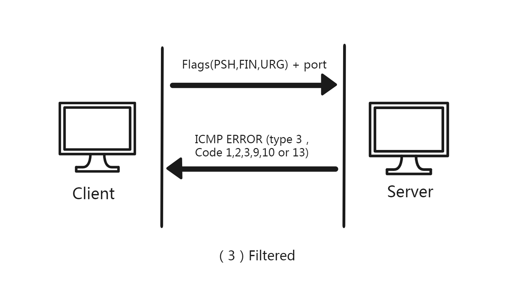

**实验端口：** http 80 open、ftp 21 closed、56  filtered 


**scapy 检测：**

```
ans,unans = sr(IP(dst = '10.0.3.2')/TCP(flags = 'FPU',dport = [80,56,21])，timeout = 10)
ans,unans
ans.nsummary(),unans.nsummary()
```

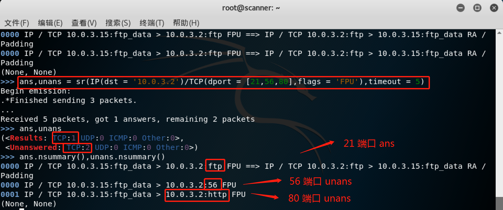


**编程测试结果：**

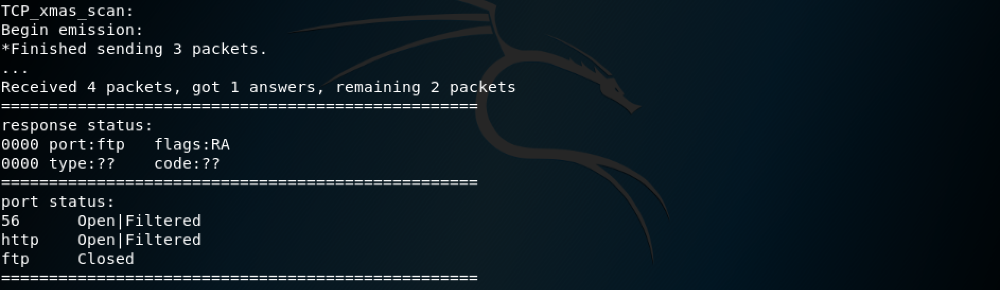
