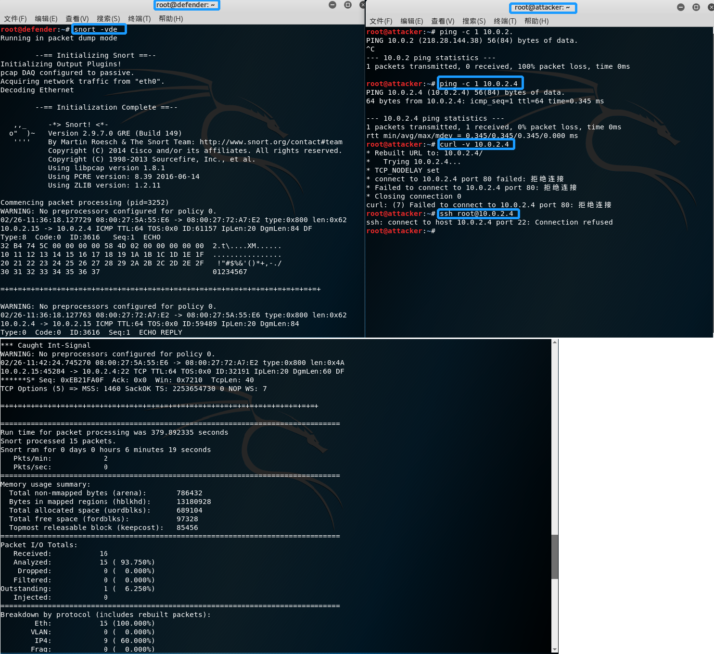
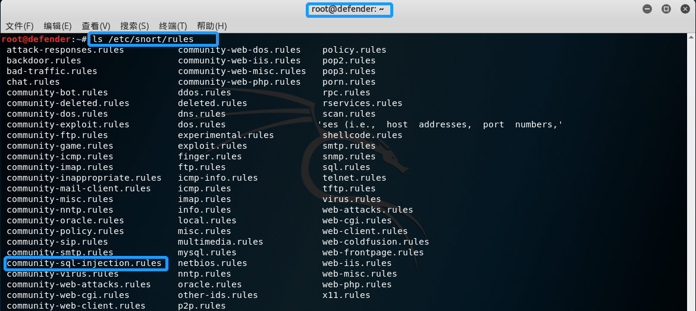
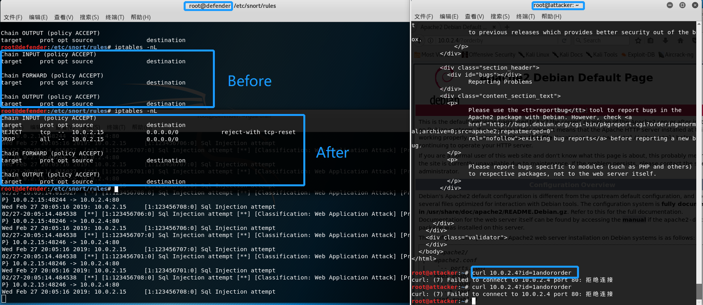

## chap0x09 实战Snort/Suricata检测SQL注入和Shellshock漏洞攻击并联动iptables进行防御

### I   实验环境

- OS: Kali  
- Net: NAT Network
- IP: Attacker >>>10.0.2.15，Defender >>> 10.0.2.4


### II   Snort 相关配置

```bash
# 禁止在apt安装时弹出交互式配置界面
export DEBIAN_FRONTEND=noninteractive

# 安装 snort 
apt install snort

# 配置snort为嗅探模式
# -v 显示IP/TCP/UDP/ICMP头
# -d 显示应用层数据
# -e 显示数据链路层报文头
snort -vde

# -b 参数表示报文存储格式为 tcpdump 格式文件
# -q 静默操作，不显示版本欢迎信息和初始化信息
snort -q -v -b -i eth1 "port not 22"
```



`snort -q -v -b -i eth1 "port not 22"`指令的执行结果这里不再截图，在`/var/log/snort/snort.log.<epoch timestamp>`会保存嗅探到的数据包。

配置`snort`内置规则:

```
# vi /etc/snort/snort.conf
# 默认定义,将 any 更改为合适的值 
ipvar HOME_NET any
ipvar EXTERNAL_NET any
```

查看 `snort`自带的规则：



```
# vi /etc/snort/rules/community-sql-injection.rules
alert tcp $EXTERNAL_NET any -> $HOME_NET $HTTP_PORTS (msg:"COMMUNITY SQL-INJECTION Microsoft BizTalk Server 2002 rawdocdata.asp"; flow:to_server,established; uricontent:"/rawdocdata.asp?"; nocase; pcre:"/rawdocdata.asp\x3F[^\r\n]*exec/Ui"; classtype:web-application-attack; reference:bugtraq,7470; reference:cve,2003-0118; reference:url,www.microsoft.com/technet/security/bulletin/MS03-016.mspx; sid:100000106; rev:1;)
alert tcp $EXTERNAL_NET any -> $HOME_NET $HTTP_PORTS (msg:"COMMUNITY SQL-INJECTION Microsoft BizTalk Server 2002 RawCustomSearchField.asp"; flow:to_server,established; uricontent:"/rawdocdata.asp?"; nocase; pcre:"/RawCustomSearchField.asp\x3F[^\r\n]*exec/Ui"; classtype:web-application-attack; reference:bugtraq,7470; reference:cve,2003-0118; reference:url,www.microsoft.com/technet/security/bulletin/MS03-016.mspx; sid:100000107; rev:1;)
alert tcp $EXTERNAL_NET any -> $HOME_NET $HTTP_PORTS (msg:"COMMUNITY SQL-INJECTION OpenBB board.php"; flow:to_server,established; uricontent:"/board.php"; pcre:"/board.php\x3F\w+\x3D[0-9]+\s/Ui"; classtype:web-application-attack; reference:bugtraq,7404; sid:100000108; rev:1;)
alert tcp $EXTERNAL_NET any -> $HOME_NET $HTTP_PORTS (msg:"COMMUNITY SQL-INJECTION OpenBB member.php"; flow:to_server,established; uricontent:"/member.php"; pcre:"/member.php\x3F\w+\x3D[0-9]+\s/Ui"; classtype:web-application-attack; reference:bugtraq,7404; sid:100000109; rev:1;)
#Rules submitted by rmkml
alert tcp $EXTERNAL_NET any -> $HTTP_SERVERS $HTTP_PORTS (msg:"COMMUNITY SQL-INJECTION WIZZ ForumTopicDetails Sql Injection attempt"; flow:to_server,established; uricontent:"/ForumTopicDetails.php"; nocase; uricontent:"TopicID|3D|"; nocase; uricontent:"union"; nocase; uricontent:"select"; nocase; uricontent:"from"; nocase; uricontent:"ForumUser"; nocase; uricontent:"where"; nocase; reference:bugtraq,15410; reference:url,www.osvdb.org/displayvuln.php?osvdb_id=20846; classtype:web-application-attack; sid:100000192; rev:2;)
alert tcp $EXTERNAL_NET any -> $HTTP_SERVERS $HTTP_PORTS (msg:"COMMUNITY SQL-INJECTION WIZZ ForumAuthDetails Sql Injection attempt"; flow:to_server,established; uricontent:"/ForumAuthDetails.php"; nocase; uricontent:"AuthID|3D|"; nocase; uricontent:"union"; nocase; uricontent:"select"; nocase; uricontent:"from"; nocase; uricontent:"ForumUser"; nocase; uricontent:"where"; nocase; reference:bugtraq,15410; reference:url,www.osvdb.org/displayvuln.php?osvdb_id=20845; classtype:web-application-attack; sid:100000193; rev:2;)
alert tcp $EXTERNAL_NET any -> $HTTP_SERVERS $HTTP_PORTS (msg:"COMMUNITY SQL-INJECTION WIZZ ForumReply Sql Injection attempt"; flow:to_server,established;  uricontent:"/ForumReply.php"; nocase; uricontent:"TopicID|3D|"; nocase; uricontent:"union"; nocase; uricontent:"select"; nocase; uricontent:"from"; nocase; uricontent:"ForumUser"; nocase; uricontent:"where"; nocase; reference:bugtraq,15410; reference:url,www.osvdb.org/displayvuln.php?osvdb_id=20847; classtype:web-application-attack; sid:100000194; rev:2;)
alert tcp $EXTERNAL_NET any -> $HTTP_SERVERS $HTTP_PORTS (msg:"COMMUNITY SQL-INJECTION BXCP Sql Injection attempt"; flow:to_server,established; uricontent:"/index.php"; nocase; uricontent:"where="; nocase; uricontent:"union"; nocase; uricontent:"select"; nocase; pcre:"/\x2b\w*\x54\w*/"; reference:bugtraq,18765; reference:url,www.milw0rm.com/exploits/1975; classtype:web-application-attack; sid:100000690; rev:2;)
alert tcp $EXTERNAL_NET any -> $HTTP_SERVERS $HTTP_PORTS (msg:"COMMUNITY SQL-INJECTION Diesel Joke Script Sql Injection attempt"; flow:to_server,established; uricontent:"/category.php"; nocase; uricontent:"id="; uricontent:"union"; nocase; uricontent:"select"; nocase; uricontent:"admin"; nocase; reference:bugtraq,18760; classtype:web-application-attack; sid:100000691; rev:2;)
```

上面的规则基本上都是关键字匹配 和 `pcre`正则式的形式，这里就借用上面的关键字定义规则（关键字不全...）：

```
# vi /etc/snort/rules/my-sql-injection.rules
alert tcp $EXTERNAL_NET any -> $HTTP_SERVERS $HTTP_PORTS (msg:"Sql Injection attempt"; content:"id="; nocase; classtype:web-application-attack; sid:123456701;)
alert tcp $EXTERNAL_NET any -> $HTTP_SERVERS $HTTP_PORTS (msg:"Sql Injection attempt"; content:"union"; nocase;classtype:web-application-attack; sid:123456702;)
alert tcp $EXTERNAL_NET any -> $HTTP_SERVERS $HTTP_PORTS (msg:"Sql Injection attempt"; content:"select"; nocase;classtype:web-application-attack; sid:123456703;)
alert tcp $EXTERNAL_NET any -> $HTTP_SERVERS $HTTP_PORTS (msg:"Sql Injection attempt"; content:"|27|";classtype:web-application-attack; sid:123456704;)
alert tcp $EXTERNAL_NET any -> $HTTP_SERVERS $HTTP_PORTS (msg:"Sql Injection attempt"; content:"substring"; nocase;classtype:web-application-attack; sid:123456705;)
alert tcp $EXTERNAL_NET any -> $HTTP_SERVERS $HTTP_PORTS (msg:"Sql Injection attempt"; content:"order"; nocase;classtype:web-application-attack; sid:123456706;)
alert tcp $EXTERNAL_NET any -> $HTTP_SERVERS $HTTP_PORTS (msg:"Sql Injection attempt"; content:"and"; nocase;classtype:web-application-attack; sid:123456707;)
alert tcp $EXTERNAL_NET any -> $HTTP_SERVERS $HTTP_PORTS (msg:"Sql Injection attempt"; content:"or"; nocase;classtype:web-application-attack; sid:123456708;)
alert tcp $EXTERNAL_NET any -> $HTTP_SERVERS $HTTP_PORTS (msg:"Sql Injection attempt"; content:"&&"; nocase;classtype:web-application-attack; sid:123456709;)
alert tcp $EXTERNAL_NET any -> $HTTP_SERVERS $HTTP_PORTS (msg:"Sql Injection attempt"; content:"&"; nocase;classtype:web-application-attack; sid:123456710;)
alert tcp $EXTERNAL_NET any -> $HTTP_SERVERS $HTTP_PORTS (msg:"Sql Injection attempt"; content:"|7c|"; nocase;classtype:web-application-attack; sid:123456711;)
alert tcp $EXTERNAL_NET any -> $HTTP_SERVERS $HTTP_PORTS (msg:"Sql Injection attempt"; content:"--"; nocase;classtype:web-application-attack; sid:123456712;)
alert tcp $EXTERNAL_NET any -> $HTTP_SERVERS $HTTP_PORTS (msg:"Sql Injection attempt"; content:"#"; nocase;classtype:web-application-attack; sid:123456713;)


# vi /etc/snort/rules/my-shellshock.rules
alert tcp $EXTERNAL_NET any -> $HTTP_SERVERS $HTTP_PORTS (msg:"Shellshock attempt"; content:"() {"; threshold:type limit, track by_src, count 1, seconds 60; sid:123456789;)


# vi /etc/snort/snort.conf
include $RULE_PATH/my-shellshock.rules
include $RULE_PATH/my-sql-injection.rules
```

### III   guardian配置

```bash
# 下载压缩包
wget **************************/attach/guardian.tar.gz

# 解压缩 Guardian-1.7.tar.gz
tar zxf guardian.tar.gz
cd guardian

# 安装 Guardian 的依赖 lib
apt install libperl4-corelibs-perl

# vi guardian.conf
HostIpAddr 		10.0.2.4      
Interface       eth0
```

注意:`HostIpAddr`不能写成 `10.0.2.4/32`(无域间类)，`guardian.pl`中`targethash`的识别会出现问题。

### IV   实验测试

```bash
# 开启 snort, 后台运行
snort -q -A console -b -i eth0 -c /etc/snort/snort.conf -l /var/log/snort/ -D

# 启动 guardian.pl
perl guardian.pl -c guardian.conf
```

实验结果如下:



手动添加锁定地址或删除锁定地址，直接使用 `guardian` 自带的`bash`脚本:

```bash
# 删除对 attacker 地址锁定
bash -e guardian_unblock.sh 10.0.2.15 eth0

# 添加对 attacker 地址锁定
bash -e guardian_block.sh 10.0.2.15 eth0
```


### 参阅

- [Snort 中文手册](http://www.kaiyuanba.cn/content/network/snort/Snortman.htm)
- [3.8 Rule Thresholds](http://manual-snort-org.s3-website-us-east-1.amazonaws.com/node35.html)
- [什么是ShellShock攻击？](https://zhuanlan.zhihu.com/p/35579956)